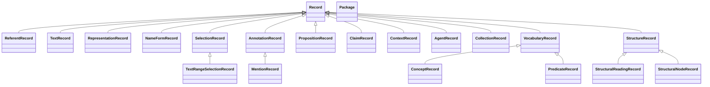

# An abstract text model for a possible TEI P6

## 1. Purpose and scope

This chapter proposes a serialization-independent model for encoding and
interpreting texts and describing their referents. Its intended applications
include editions, language corpora, and documentary catalogues. A fixed text
sequence supports attributed structural readings and interpretations. The
executable candidate expresses editorial text identity through continuity
claims; the wider design generalizes the identity question beyond editions.
The chapter defines the candidate objects, explains their separation, and
distinguishes implemented conformance from proposed development.[^scope]

The defined scope comprises Abstract Text Model 0.1, its entity extension 0.2,
and a separately identified source-attribution profile. Sections 3 to 12
describe those record contracts. Section 14 develops the broader design
requirements without changing them or assigning a new model version. These
independent proposals confer no official TEI status. A general metamodel,
composable customization, media coordinates, and complete P5 migration require
further contracts and comparative evidence.[^scope]

The chapter supplies an independently readable semantic definition. The
[detailed model contract](../knowledge/text-model.md), the machine-readable
specifications for [0.1](../experiments/abstract_text_v01/spec.json) and
[0.2](../experiments/entities_v02/spec.json), and the
[binding contract](../knowledge/text-model-bindings.md) supply exact field
grammars and executable interfaces. Implementation limits are stated where
a check enforces less than the proposed semantic rule. The broader
[architecture argument](12-p6-design.md) evaluates the consequences of using
this model within a possible P6 architecture.[^scope]

The improved design separates linguistic content from its representations,
name forms from their uses, and structured content from an agent's stance
toward it. Documentary records identify what an interpretation discusses.
Predicate definitions state whether their arguments concern those records,
their described referents, concepts or proposition content. These distinctions
address specific ambiguities in the earlier draft and retain an explicit
boundary between documentary description and world assertions.[^documentary]

The maintained [model design](../knowledge/model-design.md) owns the proposed
semantics, while [six worked cases](../knowledge/model-examples.md) compare
their XML, JSON and RDF views. A small [documentary ontology](../knowledge/ontology.md)
defines record classes separately from the proposed domain hierarchy. Its
external alignment register records comparison candidates without importing
their axioms. This experiment formalizes a selected vocabulary and supplies
no replacement validation contract for the executable models.[^documentary]

## 2. Source distinctions that motivate the proposal

TEI P5 4.12.0 defines `anchor` as identifying a point within a text, including
points without a corresponding textual element.[^anchor] It defines `span`
as associating an interpretative annotation with a span of text.[^span] The
description of `span/@from` identifies the starting node or, when `@to` is
absent, the node of the entire annotated span.[^from] P5 also describes
`annotation` as following the Web Annotation Data Model.[^annotationsource]

The selected document-theory discussion describes string editing as a mapping
between strings rather than the modification of a persistent underlying
entity.[^stringsource] The selected discussion of optional hierarchy argues
that allowing any hierarchy or none makes hierarchy itself available for
study.[^hierarchysource]

The P5 Names, Dates, People, and Places chapter describes an organization
record as a wrapper for information about an entity, distinct from textual
references to that entity, and presents an analogy with person and place
records.[^recordsource] It frames information about people, places,
organizations, and events as statements concerning traits, states, events,
and external resources.[^statementsource] For statements about changes of
state in a person's life, it requires that they be documentable, situated
in a time frame, and relatable to other statements because their sources
may be multiple or contradictory.[^documentablesource]

These findings motivate explicit distinctions among location, interpretation,
continuity, and statements about referents. They do not entail a unique
object model. The following definitions select one candidate and make its
choices testable. Where P5 already expresses a distinction, the proposal
must explain the value and cost of a different formal representation. The
supporting analyses of [annotation and overlap](06-annotation-and-overlap.md)
and [metadata and entities](08-metadata-and-entities.md) develop those
requirements in greater detail.[^alternatives]

## 3. The package and its objects

An instance is a finite package whose records have package-wide unique local
identifiers. References resolve within that package by record category.
The package declares its model version. The textual core comprises the
following sets, with reading nodes contained in their respective readings.
The notation defines categories of records and imposes no file format.[^package]

The package can be written as `P0.1 = (A, C, T, V, K, S, H, N, L)`, where
`A` denotes agents, `C` concepts, `T` editorial Texts, `V` versions, `K`
continuity claims, `S` selections, `H` readings with their nodes, `N`
annotations, and `L` relations between records.[^package]

Version 0.2 adds entity records `E`, name claims `F`, denotation claims `D`,
and statements `J`. It also admits alignment claims on agents, concepts,
and entities, and optional publication identifiers for a package. These
additions preserve the textual record categories. Upgrading a 0.1 package
also requires checking for collisions with the three mention-concept IDs
reserved by 0.2, so adding empty collections and changing the version field
is insufficient for every possible 0.1 package.[^package]

| Object | Definition | Reason for a separate identity |
|---|---|---|
| Agent | An identified editor or processor responsible for a claim. | Responsibility can be inspected without authenticating the outside person or process.[^package] |
| Concept | A semantic type with an ID, label, definition, and applicable role. | A type can be referenced independently of its label and its classified occurrences.[^package] |
| Text | An editorial grouping identity supported by positive continuity claims. | Continuity can connect different sequences under a stated criterion.[^identity] |
| Version | A fixed Unicode sequence with a content hash and declared technical parents. | Exact content can be checked independently of historical transmission.[^version] |
| Continuity claim | An agent's assertion that a nonempty set of versions belongs to one Text under a criterion. | The grouping decision retains its responsibility and rationale.[^identity] |
| Selection | A version reference and a selector specifying locations. | An intention remains inspectable when its resolution is ambiguous or absent.[^selection] |
| Reading | An attributed containment forest over one version. | Competing structures retain separate nodes and responsibility.[^structure] |
| Reading node | An occurrence in one reading with a concept, selection, and optional parent. | Equal extents do not collapse distinct structural occurrences.[^structure] |
| Annotation | An attributed interpretive body targeting a selection. | Interpretation can change independently of the chosen location.[^annotation] |
| Relation | An attributed, directed, typed link between two package records. | The link can itself be addressed by further claims.[^annotation] |

Concepts have role `node` or `relation` in 0.1. Version 0.2 adds `statement`.
The role constrains where a concept can be used. Its definition remains a
string interpreted by editors or domain processors. No subtype inference
follows from that string. A label such as "precedes" or "same work" adds
no validation rule by itself.[^package]

## 4. Text identity and version identity

Let `c(v)` denote the character sequence of version `v`. Equality of `c(v1)`
and `c(v2)` establishes content equality while leaving different version IDs
distinct. Transcriptions of two witnesses may therefore carry identical
characters without becoming one version record.[^identity]

A continuity claim has the essential form `(t, a, criterion, U)`, where `t`
is a Text, `a` an Agent, and `U` a nonempty set of version IDs. Every Text
has at least one continuity claim. A version may occur in several claims
and Texts, or in none. The model records attributed membership rather than
a partition assigning each version to exactly one text.[^identity]

The criterion states the editorial question being answered. For a corrected
transcription, it may identify the same witness, selected textual unit, and
transcription task. For diplomatic and normalized transcriptions, it must
also state the rendering policies. Validation checks that a criterion
exists. Its adequacy requires editorial assessment.[^identity]

| Illustrative case | Proposed treatment | Remaining question |
|---|---|---|
| A reading error is corrected. | Create a new version and justify continuity under the same transcription task. | Is the corrected reading philologically sound?[^identity] |
| Diplomatic and normalized renderings differ in spelling. | Retain both versions and justify their grouping under a named purpose. | Does an annotation remain appropriate for both?[^identity] |
| Two catalogue objects are assigned to one work. | Keep the objects separate and record work assignments as statements. | Are they parts, drafts, copies, or independent witnesses?[^identity] |
| A draft and an executed letter concern the same communication. | Retain distinct documents and justify any grouping or derivation claim. | Does the research task constitute one editorial Text?[^identity] |
| No continuity claim connects two versions. | Preserve the absence of a positive grouping assertion. | Their difference is not thereby asserted.[^identity] |

A work, material object, catalogue description, and editorial Text have
different roles. The entity extension can represent a material object under
kind `object` and a work under `other` within a declared profile. This
convention supplies no general work ontology. A Version holds the chosen
digital sequence, which may be a transcription, reading projection, or XML
source excerpt. Its application contract must identify what the sequence
represents.[^entity]

Version `parents` name declared technical construction inputs and form an
acyclic graph. They are frozen with the record. Correcting the declaration
requires a new version ID even when the content is unchanged. An empty list
means no inputs are recorded. Historical hypotheses about copying require
attributed claims with their own revision rules. Technical parentage alone
establishes neither historical transmission nor editorial continuity.[^version]

## 5. Coordinates, selections, and resolution

Positions count Unicode code points from zero through the version length.
The coordinate system preserves exact characters without normalizing case,
whitespace, line endings, or combining characters. Bytes, UTF-16 code units,
grapheme clusters, and tokens require different coordinate contracts. The
accepted strings are UTF-8 encodable and exclude lone surrogates. A point
at zero is valid even in an empty version.[^selection]

| Selector | Meaning | Constraint |
|---|---|---|
| `point` | One location between code points, including either endpoint. | Its integer offset is within bounds.[^selection] |
| `ranges` | One aggregate region comprising an ordered nonempty list of segments. | Each is a nonempty half-open interval `[start,end)` with its exact quote. Segments are ascending and disjoint. Adjacent segments remain distinct.[^selection] |
| `quote` | Occurrences of an exact nonempty string, optionally qualified by immediately adjacent literal prefix and suffix. | The policy explicitly selects `match: one` or `match: all`.[^selection] |

A discontinuous region is one target with several segments. An all-match
quote selection yields a separate target for each occurrence. These structures
distinguish selected pieces considered together from occurrences considered
individually. Flattening both into an undifferentiated interval list would
discard that distinction.[^selection]

In the synthetic sequence `aaa`, quote `aa` with `match: all` returns
`[0,2)` and `[1,3)` as two targets, including the overlap. With `match: one`,
the two matches produce ambiguity, two candidates, and no accepted target.
The same overlapping intervals are invalid as components of one `ranges`
selector because its segments must be disjoint.[^selection]

Resolution returns the version, status, targets, and candidates. A quote
without a match is `absent`. Multiple matches under `one` are `ambiguous`.
Both states can occur in a valid package, with warnings. By contrast, a
positional segment whose exact quote disagrees with the referenced content
violates the range contract. An unresolved editorial intention and an
inconsistent coordinate declaration therefore have different outcomes.[^selection]

## 6. Structure as an attributed reading

A Reading is a finite nonempty forest over one version. Each node selects
exactly one nonempty contiguous region in that version. Adjacent segments
may jointly constitute this region. A gap, point, unresolved selection, or
plurality of independent targets cannot serve as a reading-node extent.
The broader selection vocabulary remains available to annotations.[^structure]

Every parent belongs to the same reading, the parent relation is acyclic,
and each child's interval lies within its parent's interval. Siblings,
including forest roots, may touch but cannot overlap. Their order follows
their start positions rather than serialized record order. Parent and child
may have equal extents. A reading need not cover the entire version.[^structure]

For `abcd`, one reading can divide `[0,2)` and `[2,4)`, while another divides
`[0,1)` and `[1,4)`. Both satisfy their own rules. The model privileges neither.
An occurrence belongs to one reading, so corresponding occurrences in two
readings retain distinct node IDs and may be linked by an attributed relation.
The [competing-readings package](../experiments/abstract_text_v01/examples/competing-readings.json)
provides a complete encoded example.[^structure]

This choice permits crossing interpretations without imposing one global tree.
It also restricts structural expressivity. A discontinuous unit can receive
an annotation but cannot be a node in the defined forest. That substitution
changes the available structural operations. Discontinuous reading nodes
would require a revised containment contract.[^structure]

## 7. Interpretation and links

An Annotation targets a Selection and carries an interpretive body attributed
to an Agent. Its body is an uninterpreted string. Several annotations can
target one selection and disagree, and an annotation can retain an unresolved
selection. Version 0.2 adds an optional concept with role `node` to classify
the selected occurrence.[^annotation]

A Relation connects a source record to a target record under a concept with
role `relation` and identifies its responsible agent. Endpoints can be any
identified package records, including claims. Directed cycles and self-links
are allowed unless an additional profile constrains a relation type. The
core supplies addressable links while leaving domain semantics explicit in
such profiles.[^annotation]

Reanchoring preserves the distinction between locating and interpreting.
The implemented operation accepts 0.1 packages. A corresponding 0.2 operation
has not been defined. It requires a resolved source selection and a continuity claim
containing both versions. A quote selector retains its exact string, context,
and policy. A single-segment range becomes a single-choice quotation search.
Points and multisegment ranges are unsupported. The result remains an
unaccepted proposal, and the operation changes no selection or annotation.
A unique destination match still requires a judgment about the continued
applicability of the interpretation.[^annotation]

## 8. Entities, names, and identification

An Entity is an identity record for something the edition discusses. It has
an ID, display label, and constitutive kind from `person`, `group`, `place`,
`event`, `object`, and `other`. Its label serves display and makes no name
claim. Facts about the referent are expressed through claims. Classifying
the kind as constitutive remains an ontological commitment of the proposal,
whose adequacy must be evaluated.[^entity]

A mention is a reading node or concept-bearing annotation classified through
one of the reserved concepts `en-proper-noun`, `en-referring-string`, or
`en-pronoun`. The concept classifies the expression. The referent's kind
belongs to an entity. Discontinuous or unresolved mentions use annotations,
and a mention may exist before an entity is identified.[^denotation]

A Name claim states that an entity bears a name form. It records the entity,
a nonempty form, a language tag under the contract's bounded lexical grammar,
and optional ordered parts. Part kinds are `surname`, `forename`, `role-name`,
`add-name`, `name-link`, and `gen-name`. Parts have no IDs, remain flat, and
cannot individually serve as claim subjects. Several names may coexist,
each with optional temporal validity, without a preferred form.[^name]

The extension covers names borne by identified entities. Independent name
objects without bearers, recursive name structure, and separately attributed
components remain outside its scope. An onomastic resource relating names
independently of their bearers exposes this limit. Minting an arbitrary
entity solely to satisfy the shape would conceal the missing distinction.[^name]

A Denotation claim states that one mention denotes one entity. Its subject
is the mention, and its content names the entity. Editors can identify the
same mention differently. One editor may also retain several current
candidates. No winner follows from validation. Changing the identified
entity can revise the same agent's claim about the same mention.[^denotation]

An Alignment claim connects an entity, agent, or concept record to an
external IRI under `exact`, `close`, `broader`, or `narrower`. `exact`
asserts interchangeability for the package's purposes, `close` for some
unspecified purposes, `broader` points to something more general, and
`narrower` to something more specific. These claims produce no inference.
Validation neither fetches the external resource nor merges records aligned
to one IRI. Denotation and alignment thus record separate decisions.[^denotation]

## 9. Statements and the common claim pattern

A Statement concerns a nonempty set of participant entities. Each participant
has a role string, and repeated entity-role pairs are invalid. The statement
has kind `trait`, `state`, `event`, or `relation`, a concept with role
`statement`, and an optional nonempty string value. Domain profiles must
define the semantics of those types and roles. A Statement of kind `relation`
differs from a generic Relation, whose endpoints may be arbitrary records.[^statement]

The subject of a Statement is the set of participant entities. Roles, kind,
type, and value are content. Reversing roles between the same entities can
revise the content. Replacing a participant changes the subject and requires
withdrawal followed by a new claim. An event entity supplies an identity
that can participate in statements. A statement of kind `event` makes an
assertion concerning its participants. The model does not automatically
equate those constructions.[^statement]

New claim kinds require an ID, agent, creation instant, and status. They may
carry certainty, temporal validity, and supersession links. The inherited
Continuity, Reading, Annotation, and Relation kinds retain the 0.1 fields
and accept these additions optionally. An absent legacy status reads as
`asserted`, while a missing creation instant remains undated.[^claim]

| Field | Meaning | Interpretation boundary |
|---|---|---|
| `created` | UTC instant when the claim record was made. | It establishes no historical event date or revision order.[^claim] |
| `status` | `proposed`, `asserted`, or `withdrawn`. | These model statuses differ from the repository's research-review statuses.[^claim] |
| `certainty` | Optional `high`, `medium`, or `low`, attributed to the claiming agent. | The labels supply no probabilities or common calibration across editors.[^claim] |
| `valid` | Optional bounds on the claimed state of affairs, at year, month, or day precision. | A date inside the content, such as a birth date, remains separate.[^claim] |
| `supersedes` | IDs of earlier claims revised by this claim. | Links must stay within the same claim kind, agent, and subject, and remain acyclic.[^revision] |

In a synthetic example, a claim recorded in September states that a person
resided in a city during April. Record time and validity differ. A separate
claim about a letter's dispatch on 17 April carries that date as content.
A dateline copied from the letter is another textual observation. The pattern
permits these distinctions but its generic string values neither enforce a
date datatype nor establish that a dispatch occurred.[^claim]

## 10. Revision and historical integrity

The proposed revision rule preserves earlier claims under their IDs. A
revision appends a new record with a supersession link. Withdrawal uses
status `withdrawn` and supersedes at least one earlier claim. A claim is
current when no claim supersedes it, irrespective of its timestamp or status.
A current withdrawal can therefore exist while the default denotation view
hides it. A `proposed` claim is not automatically excluded by that view.
Claims from different agents coexist and cannot supersede one another.[^revision]

The subject is the Text for continuity, the version for a reading, the
selection for an annotation, the source record for a generic relation, the
entity for a name, the mention for denotation, the participant entity set
for a statement, and the containing record for an alignment. These choices
determine whether a correction revises content or introduces another
subject.[^revision]

A version hash checks current UTF-8 content. Comparing valid packages can
additionally detect a reused version ID whose content, hash, or technical
parents changed. The 0.2 revision operation rejects deletion or alteration
of earlier claim records. Such comparisons require the caller to establish
a shared ID scope. They provide neither a persistent history service nor
authentication of an editorial event.[^revision]

The implementation does not yet protect every dependency that gives a claim
meaning. A retained selection ID can receive a different selector while
its annotation stays unchanged. The general 0.2 revision check also permits
an entity-kind change and relocation of an unchanged nested alignment to
another carrier. The source-attribution profile protects entity kinds and
source descriptors, but does not freeze selections. An exact repeated
passage can consequently acquire another source location while its annotation
record remains unchanged. Complete historical integrity requires a contract
for preserving or explicitly revising those dependencies. The current checks
establish only their stated record-level guarantees.[^revision]

## 11. Source attribution and assessment

The optional `identity-evidence-0.1` profile applies existing 0.2 records to
source reports of six reserved types, work assignment, hand attribution,
contribution, origin date, sent-action metadata date, and dateline. Other
statements receive no automatic evidence requirement from this profile.
Its dossier holds the package and descriptors identifying
the snapshot, source URI, hash, exact byte interval, and navigational XPath
of every source-excerpt version. Checks compare actual snapshot bytes with
the version content. The URI has a checked HTTP(S) form, while the XPath is
navigation rather than an independently evaluated locator. Here each Version
contains an XML excerpt, whose role differs from a transcription of the
historical object described by that XML.[^evidence]

A work-assignment report requires exactly two participant pairs, an `artifact`
of entity kind `object` and a `work` of kind `other`. Every reserved source
report links to at least one exact passage annotation. A source
qualification, such as a question mark, has its own selected wording within
a supporting passage. The importing agent takes responsibility for transfer
without authenticating the original cataloguer or judgment. An assessment
is a separate annotation with its own agent, rationale, and optional
certainty, linked to the assessed claim. Its selection must also resolve
to one contiguous region under the profile. Source reports, passage
annotations, and qualification annotations are prohibited from carrying
`certainty`. The separate assessment can carry the assessor's own
qualification.[^evidence]

For a hypothetical catalogue passage reading "Editor B (?)", the literal
`(?)` remains a source qualification of the reported attribution. It is not
automatically converted to `certainty: low`. A new editorial assessment
receives its own rationale and responsibility. A contributor entry and a
hand description remain separate reports until an interpretation establishes
their respective scope.[^evidence]

A reader must be able to inspect the claim's exact passage and fixed source
context, the responsibility for recording or assessing it, and the difference
between inherited qualification and subsequent judgment. A matching quotation
establishes preserved wording. Whether that wording supports an interpretation
requires source-support review. The profile neither detects every omitted
qualification nor proves historical truth, and its inspection view does not
automatically filter evidence by withdrawal or supersession.[^evidence]

## 12. Conformance, equivalence, and exchange

Conformance requires correct record shapes, unique IDs, typed references,
valid selectors, and the applicable graph and claim constraints. Unknown
fields are rejected. Absent or ambiguous selections can leave a package
valid. Structural errors instead invalidate it and suppress its resolutions.
Empty collections are allowed, so an empty valid package demonstrates no
editorial accomplishment.[^acceptance]

Canonical comparison preserves IDs, exact strings, concepts, attribution,
selector kinds and policies, segment boundaries, hierarchy edges, and claim
content. It ignores ordering only where the contract declares a collection
unordered, including record registries and continuity memberships. In 0.2,
participant pairs and supersession targets are also unordered, while name
parts retain order. Absent optional fields remain distinct from present
fields. Selectors resolving to the same location can therefore remain
inequivalent because they express different policies.[^exchange]

For an encoder `E` and decoder `D`, the package-preservation law is
`equivalent(P, D(E(P)))` under the declared model version. The reference
JSON, XML, and YAML bindings implement this contract for 0.1 packages. Version
0.2 has JSON packages and canonical comparison through the entity module;
the general codecs reject 0.2, so its cross-binding preservation remains
unimplemented. The 0.1 contract promises neither
identical file bytes nor conversion of arbitrary P5 documents. P5 migration
additionally requires a source interpretation, mapping rules, and criteria
for preserving the intended editorial task.[^exchange]

Version 0.2 can declare a publication `base` for record IRIs formed by
concatenating that base and a local ID. Earlier bases can be recorded through
claims. The base enters canonical comparison, so republication under another
base changes the package identity. Equal content hashes do not merge record
IDs, and external alignments supply no general cross-package resolver.[^exchange]

RDF export has a different scope. It supplies a graph without a decoder and
omits version content and resolved target structures. It uses one IRI per
record without a second IRI for discussing the record separately from its
referent. These choices preclude model-lossless RDF exchange. Exporting only
the core package also omits the source descriptors of the evidence dossier,
which has no binding contract of its own.[^exchange]

## 13. Design reasons and comparison

Each separation serves an observable task and imposes a cost. These reasons
justify evaluation of the candidate without establishing an architecture
ranking.[^alternatives]

| Decision | Intended benefit | Cost or counterexample |
|---|---|---|
| Separate Text and Version. | Attribute continuity while preserving exact sequences. | Grouping needs editorial criteria, and negative identity remains undefined.[^identity] |
| Separate Selection and resolution. | Preserve addressing intentions through ambiguity or absence. | Consumers must handle unresolved states and different target structures.[^selection] |
| Admit several attributed readings. | Preserve competing structures without selecting a global primary tree. | Cross-reading identity requires links, and discontinuous nodes remain excluded.[^structure] |
| Separate entity, name, and denotation. | Revise identification without overwriting a mention or other entity claims. | More records are required, and bearer-independent names remain unsupported.[^entity] |
| Make claims addressable. | Inspect attribution, disagreement, and particular revisions. | Encoding obligations increase, and dependency preservation remains incomplete.[^revision] |
| Define equivalence before bindings. | Test preservation across syntaxes. | Every binding needs a maintained mapping and failure cases.[^exchange] |

A primary tree with separately attributed stand-off structures remains a
comparison architecture. It can preserve secondary structures if it records
their nodes, extents, responsibility, and processing rules. The present
candidate makes sequences and readings explicit at package level. Authoring,
teaching, querying, and migration must be compared on equivalent tasks.
Crossing structures alone establish no expressivity winner.[^alternatives]

Repair within P5 could improve a convention or its tooling. Compatible
evolution could specify selection and revision behavior while preserving
existing document contracts. Replacement would additionally need to justify
new bindings, customization, and migration costs. Deferral remains appropriate
where a requirement or preservation policy is unresolved. Evaluation of this
model keeps these outcomes open.[^alternatives]

## 14. Boundaries and acceptance

The executable model covers textual sequences, editorial continuity, selected
locations, attributed structures, and claims about entities. The proposed
extensions below define a wider target. Arbitrary properties, ordered
mixed-content occurrences, reusable constraints, blueprints, and customization
composition remain subject to the requirements consolidated in
[model design](../knowledge/model-design.md). Those capabilities do not follow
from generic relations or concept-definition strings.[^limits]

Representational gaps include media coordinates, independent name objects,
negative identity, richer uncertainty semantics, cross-package resolution,
and a general work and witness ontology. Creation of a reading sequence
also requires an explicit projection policy. Flattening mixed content
does not establish which notes, additions, or other material belong to that
chosen sequence.[^limits]

### 14.1 Text across editions, corpora and catalogues

For the wider design, a Text is provisionally an identifiable unit of linguistic
content whose boundaries and identity follow explicit criteria. A `TextRecord`
documents that content identity. Representation assignment and continuity are
separate propositions. The actor choosing the criteria can work on an edition,
a corpus or a descriptive catalogue. An arbitrary grouping criterion does not
establish linguistic identity. The current executable `Text` record
implements attributed version grouping; its formal meaning remains the one
defined in section 4. Generalizing the definition requires demonstrating the
relationship between that grouping and a linguistic-content identity.[^applicationneutral]

A fixed character sequence is one representation state. A change of
tokenization can produce another structural analysis while leaving that
sequence intact. A corpus groups resources for a research purpose without
asserting they are the same text. A catalogue entry describes a document and
may itself contain text; its description is distinct from the described
document's content. A document must be describable before a transcription
exists. Material carriers and digital representations require their own
identity criteria.[^applicationneutral]

Two independently written letters can share a character sequence while retaining
distinct text identities. Two transcriptions can represent one text while
differing in their strings. A corpus can contain both letters without asserting
their sameness. These counterexamples distinguish text identity, representation
identity and collection membership. The criteria must state which distinction
is being asserted and remain open to revision with new evidence.[^applicationneutral]

These distinctions prevent a single inherited `Text` label from covering a
work, a physical manuscript, a catalogue record, a corpus, and a particular
transcription indiscriminately. The mapping must state which object the source
identifies and retain undecided identity where the evidence does not resolve
it. A general `Version` name must likewise not imply that every technical
sequence revision is a historical version of a work.[^applicationneutral]

### 14.2 Names, mentions and described events

The proposed extension introduces an independently addressable `NameFormRecord`
for a documented form. Its spelling, language, script and components are
distinct from its use to identify someone or something. A textual mention can
be related both to that form and, through a separate identification proposition,
to an intended referent. An unidentified occurrence can receive a proposed
referent category before a person or place is identified.[^independentnames]

Person name, organization name, place name and country name classify naming
uses or assignments. They are not intrinsic subclasses of a form record.
The constructed `Victoria` case uses one form for two differently interpreted
occurrences, a person and a place. The two referents retain separate identities.
A separate Name object grouping several forms would require a further identity
criterion. That additional abstraction is deferred until a concrete naming
practice requires it.[^independentnames]

Name components, languages and scripts describe the form. A pseudonym,
official usage, or preferred display form needs the relevant assignment and
context. A personal name need not have the same components in every naming
tradition. The current flat name-claim parts and the three mention concepts
remain the bounded 0.2 implementation. Independent form records and their
contextual realizations require a separate instance contract.[^independentnames]

The user-supplied illustrative sentence in the
[worked example](../knowledge/model-examples.md#worked-example-a-described-letter)
introduces two person referents, their name occurrences, a letter referent,
and a described writing event. Its interpretation assigns a writer and an
intended recipient. The sentence is distinct from the text of the mentioned
letter. No completion, dispatch or receipt follows merely from the writing
predicate, and a local person identifier supplies no biographical verification.
The responsibility for the annotation differs from the writer's role in the
described event.[^independentnames]

The revised design also separates proposition, claim and annotation. A
`PropositionRecord` contains the specified subject, predicate, object and
interpretation context. A `ClaimRecord` identifies an agent's stance toward
that content. An `AnnotationRecord` links a selected target to a documentary
body, which can be a proposition or claim. Its target and the evidence passage
supporting an interpretation can differ.[^propositions]

The same proposition can be asserted by one agent, reported by a second and
denied by a third. Reporting supplies no endorsement. Questioning differs from
assertion, and withdrawal concerns the claim's lifecycle rather than negation
of its content. Identified proposition reuse makes this disagreement inspectable.
It proves no equivalence between differently worded contents. An interface may
accept inline proposition fields and expand them into these records, preserving
the specified responsibility, scope and stance.[^propositions]

### 14.3 Stable classes and open classifications

A core class should introduce a documented identity distinction or additional
semantic rules. Organization activity, purpose and form should instead be
available as separate repeatable classifications using identified concepts.
An organization may participate in several fields and change its activities.
Domain profiles can constrain a vocabulary without closing the shared model
to further legitimate categories.[^opentyping]

A classification can appear as a simple property in an authoring interface.
Its abstract relationship to a concept must remain defined. When the
assignment is contested, dated or sourced, its claim identity carries those
qualifications. A vocabulary hierarchy supports broader and narrower terms;
it does not by itself add ontology subclass inference to the executable model.
Whether a particular distinction warrants a subclass must be tested against
its definitions and processing consequences.[^opentyping]

Person and Organization remain useful proposed domain types. Writer, intended
recipient and member are roles in a particular relationship or activity.
Treating every distinction as a vocabulary value would obscure this difference.
A change in an organization's activity need not create a different organization,
while adopting a document type or domain subclass can impose meaningful new
rules. The decision is made for the particular distinction.[^opentyping]

### 14.4 Places, contexts and existence claims

The place design separates an identified referent from its physical or spatial
correspondence and from statements made about it. Object kind, location,
historical use, cultural meaning, narrative context and epistemic assessment
answer different questions. A historical name or uncertain location cannot
by itself determine whether an entity exists in the geographic world.
Religious attribution does not automatically classify a referent as fictional.
Source date, claimed validity, narrated time and annotation time remain
distinct.[^scopedreferents]

The Olympus and Atlantis walkthroughs in
[Model Examples](../knowledge/model-examples.md) are proposed tests of these
distinctions. A physical description and a cultural attribution may concern
one referent. A text can also introduce an imagined spatial setting whose
relationship to a geographic feature remains an explicit interpretation.
Creating a referent record supplies an annotation target without establishing
physical existence or a coordinate. A scholarly assessment of an account and
the account's own assertions must retain separate scopes. The geographic
identification example explicitly proposes that two handles describe the same
intended referent while retaining their separate record identities. It leaves
the identification unaccepted and introduces no automatic identity assertion.[^scopedreferents]

An IRI alone supplies no proof of physical existence. The relevant commitments
come from the defined classes, relations and interpretation context. A
geographic feature, a spatial extent, a historical settlement and a religiously
significant place description must not be conflated merely because they share
a label or coordinate. Describing an unknown location remains possible.[^scopedreferents]

A context-qualified claim must not become an unqualified geographic fact in
an export or query. The future binding must preserve the scope, produce a
declared projection or reject the unsupported claim. The current 0.2 graph
export supplies no such general context-preservation contract. External
ontology comparison must examine identity, domain, range and inference
obligations before assigning equivalence between similarly named
classes.[^scopedreferents]

### 14.5 P5 preservation and practical acceptance

The preservation target is the full functional range of each declared P5
topic boundary. A capability matrix must connect effective declarations,
Guidelines interpretation and real customized documents to the distinctions
the candidate preserves. The existing 0.2 matrix answers the bounded findings
of chapter 08; it is not an inventory of every relevant P5 capability. A
proposed repair must be tested alongside the successful behavior that could
regress.[^compatibility]

Compatibility has separate tests for unchanged P5 input, semantic
preservation, return to P5, lexical or byte identity, and existing-tool
behavior. The input includes the applicable ODD and processing conventions.
Expected preservation must be specified independently of the converter. A
retained source file permits archival recovery but does not demonstrate that
the abstract model interpreted its content. An advanced feature without a
P5 equivalent requires an explicit reverse-mapping boundary.[^compatibility]

Simple inline authoring should remain possible through a documented mapping
to the richer model. An importer may record its own transfer activity; it
must not invent a source author's identity, an absent certainty, an intended
referent or a historical date. Progressive complexity is assessed by the
concepts and declarations a user must supply for the same task. The complete
criteria and compatibility axes have their single home in
[P6 evaluation](../knowledge/p6-evaluation.md) and the
[migration contract](../knowledge/p6-architecture.md#examples-and-migration).[^compatibility]

Every developed example must be considered in XML, JSON and RDF against the
same conceptual instance and preservation expectations. RDF may be shown as
Turtle; a proposed example syntax must be distinguished from an implemented
binding. Identifiers, literal/reference distinctions, order, uncertainty and
context must agree across the views. An unsupported feature remains a named
gap rather than disappearing from one representation. The existing YAML
binding retains its separate contract.[^compatibility]

### 14.6 Documentary ontology and class hierarchy

The experimental ontology chooses a documentary root. Record subclasses
describe information with distinct identity and reference contracts. The
broader domain hierarchy classifies the intended objects of descriptions.
A ReferentRecord describing a person is consequently a documentary handle,
and an external Person class is not its superclass. A later bridge may
identify the described person through a separate, qualified relation.[^documentary]

The full [record hierarchy](../ontology/record-hierarchy.mmd) is generated from
[core.ttl](../ontology/core.ttl). Its branches are summarized below. Arrows
denote subclass relationships and are independent of textual containment or
chronological order.[^documentary]

The diagram summarizes the proposed documentary classes.[^documentary]

Package identifies the exchanged set of records; a CollectionRecord describes
a corpus or another collection. The two memberships are distinct. The generic
SelectionRecord admits further selection contracts, while TextRangeSelectionRecord
specifies the contiguous Unicode range used by the ontology experiment.
Its existence does not remove the richer selectors of the executable 0.1 model.
Likewise, structural classes identify reading descriptions without yet supplying
a general mixed-content algebra or a complete validation profile.[^documentary]

Every predicate record declares an argument interpretation. The `record` mode
concerns a documentary record and its fields, `referent` the object intended
by a referent handle, `concept` a vocabulary value, and `proposition` a recorded
content. The name-assignment predicate, for example, uses a referent subject
and a form-providing record object. This rule removes the earlier ambiguity
about whether the database record itself bears the person's name.[^documentary]

The [alignment register](../ontology/alignment-candidates.ttl) documents
external targets, comparison relations, source pointers and prerequisites.
These entries are annotations for assessment. They supply no imports,
subclass axioms, equivalences or identity declarations. A future bridge must
justify its formal consequences for a named task. Importing every compared
ontology is not an acceptance condition.[^documentary]

The ontology's RDF/XML and JSON-LD files serialize its RDF class-and-property
graph. They do not constitute XML and JSON bindings for TEI instances. The
separate example comparison concerns complete illustrative instance records.
Neither operation proves world truth, full OWL consistency, successful P5
migration or usability.[^documentary]

### 14.7 What the current checks establish

Evaluation must separately assess the definitions, implemented behavior,
source support, and adequacy across the declared use contexts. The
[experiment contracts and cases](../knowledge/experiments.md) provide
reproduction entry points, while the
[project state](../knowledge/state.md) records dated results. Passing finite
checks establishes the behavior of those cases. It does not establish full
P5 coverage or community acceptance.[^acceptance]

Revision is required when a required distinction cannot be represented
without changing its meaning, when a claim changes through an unprotected
dependency, or when a competing architecture performs the same task with
fewer burdens and comparable preservation. Acceptance of the bounded model
requires independently selected cases and explicit domain judgment of
those conditions.[^acceptance]

[^anchor]: Grounded in [[30_assertions/p5-anchor-identifies-a-textual-point]].
[^span]: Grounded in [[30_assertions/p5-span-associates-interpretation-with-text]].
[^from]: Grounded in [[30_assertions/p5-span-from-identifies-start-or-whole-node]].
[^annotationsource]: Grounded in [[30_assertions/p5-annotation-refers-to-web-annotation-model]].
[^stringsource]: Grounded in [[30_assertions/renear-wickett-distinguish-string-mapping-from-persistent-identity]].
[^hierarchysource]: Grounded in [[30_assertions/piez-treats-optional-hierarchy-as-object-of-study]].
[^recordsource]: Grounded in [[30_assertions/p5-guidelines-separate-the-entity-record-from-references-to-the-entity]].
[^statementsource]: Grounded in [[30_assertions/p5-entity-information-comprises-statements-about-traits-states-and-events]].
[^documentablesource]: Grounded in [[30_assertions/p5-each-statement-about-a-life-must-be-documentable-and-time-framed]].
[^scope]: Posit: a bounded, independently readable definition makes the proposal assessable while keeping the wider architecture and executable contract distinguishable. The corresponding maintained contracts are [[knowledge/text-model]], [[knowledge/text-model-bindings]], and [[knowledge/identity-evidence]]. Open evidence question: which additional primitives are indispensable for a representative next-generation TEI core?
[^package]: Posit: finite closed packages with identified records make reference integrity and exchange obligations explicit. Open evidence question: which editing and exchange tasks require open packages or semantic operations beyond the declared roles?
[^identity]: Posit: attributed positive membership preserves editorial continuity without deriving it from string equality or work assignments. Open evidence question: which real identity decisions require negative claims, closed membership, or further categories?
[^version]: Posit: fixed content and technical inputs permit reproducible reference while historical derivation remains revisable. Open evidence question: which workflows cannot tolerate a new version identity when technical inputs are corrected?
[^selection]: Posit: points, aggregate ranges, and singular or plural quotation policies preserve different targeting intentions. Open evidence question: which editorial tasks require other coordinates or resolution policies?
[^structure]: Posit: attributed forests preserve competing readings with independently identified occurrences. Open evidence question: which discontinuous or noncontainment structures require another reading contract?
[^annotation]: Posit: separate interpretations and addressable links make targeting and semantic judgment independently inspectable. Open evidence question: which workflows support automatic reanchoring acceptance or require typed bodies?
[^entity]: Posit: constitutively typed entity identities separate from mentions and names expose the referents of claims. Open evidence question: which practices require revisable kinds, a work ontology, or additional categories?
[^name]: Posit: entity-bound name claims with ordered flat parts address a bounded naming task. Open evidence question: which name resources and component-level judgments require addressable names without bearers?
[^denotation]: Posit: denotation and alignment express separate identification decisions without automatic merging. Open evidence question: which consumers require further alignment relations or governed inference?
[^statement]: Posit: participant-based statements share attribution and revision rules while preserving declared kinds and roles. Open evidence question: which cases require typed values, addressable roles, or different subject rules?
[^claim]: Posit: one claim pattern distinguishes responsibility, record time, validity, and the agent's own qualification. Open evidence question: which workflows require richer temporal semantics or independently evolving assessments?
[^revision]: Posit: revision should preserve both earlier claims and the dependencies determining their meaning. The checks in `tools/models/entities.py` and `tools/models/identity_evidence.py` currently enforce the limited guarantees stated in section 10. Open evidence question: which dependency-preservation contract prevents silent changes of subject or evidence while permitting useful revision?
[^evidence]: Posit: the optional [[knowledge/identity-evidence]] profile keeps source wording, inherited qualification, transfer responsibility, and assessment separately inspectable. Open evidence question: which independently reviewed editorial cases require richer evidence semantics or invalidate its current location and revision rules?
[^exchange]: Posit: explicit package equivalence separates binding preservation from byte identity and P5 migration. Open evidence question: which required distinctions fail in further bindings or realistic source-to-model mappings?
[^alternatives]: Posit: benefits must be compared with P5 repair, compatible evolution, another explicit architecture, and deferral under the same tasks. Open evidence question: which measured editorial and migration outcomes justify preferring an option?
[^limits]: Posit: unsupported cases keep the bounded definition distinguishable from a complete TEI metamodel. Open evidence question: which limitations justify extending the candidate and which require changing its foundation?
[^acceptance]: Posit: conformance, observed behavior, source support, and editorial adequacy require separate judgments. Open evidence question: which independently selected cases and accountable assessments support acceptance of this proposal?
[^applicationneutral]: Posit: text identity should support editions, corpora and catalogues while distinguishing linguistic content, representations, documents and collections. This widens the design target without redefining implemented records. Open evidence question: which independently selected P5 cases determine adequate identity and correspondence rules?
[^independentnames]: Posit: independent names, mention realization, identification and context-qualified event interpretation make separable questions inspectable. The worked sentence is illustrative user-supplied research data, not a report about the people named. Open evidence question: which naming traditions and source encodings require additional distinctions or a simpler representation?
[^opentyping]: Posit: repeatable typed classifications and explicit assignments accommodate activity, purpose and form without an exhaustive core subclass tree. Open evidence question: which distinctions impose intrinsic rules that justify a class rather than a vocabulary value?
[^scopedreferents]: Posit: referent identity, spatial correspondence, narrative context and assessment require separately preserved semantics. The named place walkthroughs are design challenges; their external comparison leads have not become new premises in this chapter. Open evidence question: which scoped-query and export laws preserve these distinctions across historical, fictional and religious descriptions?
[^compatibility]: Posit: the candidate should preserve the capabilities of the declared P5 boundary and demonstrate each compatibility axis independently while keeping introductory authoring practical. Open evidence question: which P5 distinctions require a compatibility profile, policy decision or explicit loss, and which proposed repairs fail the same-task comparison?
[^documentary]: Posit: a documentary record ontology, explicit predicate argument interpretations and a separate domain hierarchy prevent silent switching between records and their described objects. External mappings remain reviewable candidates until their inference contracts are justified. Open evidence question: which real TEI tasks require direct domain identities, stronger axioms or a simpler documentary structure?
[^propositions]: Posit: independently addressable proposition content and attributed stances distinguish assertion, reporting, questioning, denial and withdrawal while permitting compact authoring. Open evidence question: which nested quotation, conflicting interpretation and uncertainty cases require a richer logical contract?
