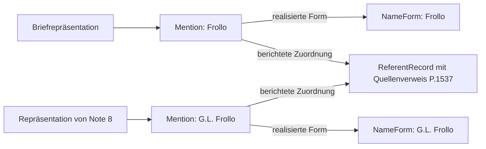

# Ein HSA-Brief von TEI P5 zum P6-Entwurf

Der Fall untersucht den vom Hugo Schuchardt Archiv als Brief von Hugo
Schuchardt an Bogdan Petriceicu Hasdeu erschlossenen Datensatz
`o:hsa.letter.4493`. Die Edition gibt den 17. April 1878 als Entstehungs- und
Versanddatum an. Unser P6-Fall übernimmt diese Angaben als Quellenberichte
mit getrennten Aussagegegenständen. Der ganze Brief einschließlich
Postskript und elf editorischer Anmerkungen ist im Paket zugänglich.

Der Versuch konkretisiert den [Abstract-Model-Proposal](../../40_output/02-abstract-model.md)
und die [dokumentarische Ontologie](../../knowledge/ontology.md). Er definiert
ein experimentelles Fallprofil. Eine offizielle P6-Syntax oder ein allgemeiner
P5-Konverter wird dadurch nicht festgelegt.
Der gepflegte [Profilvertrag](../../knowledge/hsa-profile.md) definiert
die Zuordnungen, Feldregeln und Versionsgrenzen. Er enthält auch denselben
Aussageausschnitt in XML, JSON und RDF.

## Material und Einstieg

Die Grundlage ist die bereits aufgenommene
[TEI-Quelle des HSA](https://gams.uni-graz.at/o:hsa.letter.4493/TEI_SOURCE)
im Snapshot vom 7. September 2026. Die
[unveränderliche Repräsentation](../../10_markdown/documents/hsa-letter-4493-2026-09-07.md)
enthält die vollständige XML-Antwort mit Attribution und Herkunftsdaten.
Ihre SHA-256-Prüfsumme lautet
`f37ff85df57405753aa0b6d1db63f3a24fcbd33ab1ef7fb54b68844e556e2438`.
Die Quelle erklärt CC BY-NC 4.0. Diese Lizenz gilt auch für die hier
übernommenen Quellenteile; die Projektlizenz ersetzt sie nicht.

| Datei | Inhalt |
|---|---|
| [p5.xml](p5.xml) | Unveränderte vollständige XML-Quelle, aus der aufgenommenen Repräsentation wiederhergestellt. |
| [p6.xml](p6.xml) | Semantische Records mit kurzen Bezeichnern in XML-Binding 2. |
| [p6.json](p6.json) | Derselbe semantische Teil einschließlich Referenzen und typisierten Literalen. |
| [p6.ttl](p6.ttl) | Derselbe semantische Teilgraph in RDF/Turtle. |
| [preservation.xml](preservation.xml), [preservation.json](preservation.json), [preservation.ttl](preservation.ttl) | Ergänzender Erhaltungsteil mit Quellen-XML, P5-Baumstruktur und wörtlichen Quellenwerten. |
| [instance.mmd](instance.mmd) | Diagramm der zentralen Instanzen und ihrer qualifizierten Beziehungen. |
| [vocabulary.ttl](vocabulary.ttl) | Ergänzendes Fallvokabular für Quellenbezug und erhaltene P5-Struktur. |
| [coverage.json](coverage.json) | Übernommene Merkmale, Erhaltungsumfang und Grenzen der semantischen Übertragung. |

Die vollständigen Dateien werden durch
[build_hsa_case.py](../../tools/build_hsa_case.py) erzeugt. Die Beschreibungen
dieser README erläutern die Modellentscheidungen. Die generierten Dateien
werden ausschließlich über den Generator geändert.

Für Abfragen zu Texten, Personen oder Datierungen genügt `p6.*`.
Der semantische Teil enthält auch den vollständigen projizierten Brieftext
und alle Notes. Wer XML-Struktur und Erhaltungsdaten untersuchen will,
nimmt `preservation.*` hinzu. Die Vereinigung beider Graphen erhält alle
Tripel des früheren vollständigen Falls. Der Erhaltungsteil ist von den
Referenzen im semantischen Teil abhängig.

Die Versionsnummer des Modellprofils bleibt 1. Binding 2 ändert die
Austauschschreibweise und den Lieferumfang von `p6.*`. Der Leser kann
weiterhin vollständige Dateien des Bindings 1 lesen. Bestehende Verbraucher
der eingebetteten XML-Struktur müssen den Erhaltungsteil zusätzlich laden.

## Was die P5-Quelle bereits unterscheidet

Der folgende Ausschnitt stammt aus der Korrespondenzbeschreibung. Die
Einrückung ist angepasst; die im Original vom TEI-Wurzelelement geerbte
Namespace-Deklaration wird für das alleinstehende Fragment wiederholt.

```xml
<correspDesc xmlns="http://www.tei-c.org/ns/1.0"
             ref="https://gams.uni-graz.at/o:hsa.letter.4493">
  <correspAction type="sent">
    <persName corresp="https://gams.uni-graz.at/o:hsa.persons#P.109"
              ref="https://viaf.org/viaf/261931943">
      <forename>Hugo</forename>
      <surname>Schuchardt</surname>
    </persName>
    <placeName corresp="https://gams.uni-graz.at/o:hsa.places#PL.6"
               key="#GID.1" ref="http://sws.geonames.org/2778067">Graz</placeName>
    <date when="1878-04-17">1878-04-17</date>
  </correspAction>
  <correspAction type="received">
    <persName corresp="https://gams.uni-graz.at/o:hsa.persons#P.1720"
              ref="https://viaf.org/viaf/65406496">
      <forename>Bogdan Petriceicu</forename>
      <surname>Hasdeu</surname>
    </persName>
  </correspAction>
</correspDesc>
```

Die Empfangsbeschreibung nennt eine Person. Empfangsdatum und Empfangsort
fehlen. Das Fallprofil bewahrt diese Unvollständigkeit. Es ergänzt keine
historischen Vorgänge aus plausiblen Erwartungen. Die P5-Dokumentation
definiert `correspAction` bereits als Beschreibung einer
Korrespondenzhandlung. Die vorgeschlagene P6-Modellierung übernimmt diese
Unterscheidung und macht die Verantwortung für ihre Übernahme explizit.
[TEI P5 4.12.0, correspAction](https://tei-c.org/release/doc/tei-p5-doc/en/html/ref-correspAction.html)

An anderen Stellen desselben XML stehen folgende Angaben:

```xml
<origDate xmlns="http://www.tei-c.org/ns/1.0"
          ana="dcterms:created" when="1878-04-17">1878-04-17</origDate>
```

```xml
<dateline xmlns="http://www.tei-c.org/ns/1.0"> Graz 17. 4. 78. </dateline>
```

`origDate` steht unter `msDesc/history/origin`; die Dateline steht im
Brieftext. Das gleiche normalisierte Datum bei Herkunft und Versand liefert
keine Identität der beiden beschriebenen Sachverhalte. Der Wortlaut der
Dateline enthält auch keine selbständige Begründung für die Auflösung des
Jahrhunderts. Diese Auflösung wird als Angabe der Edition übernommen.

## Die modellierten Gegenstände

| Gegenstand im Fall | Modellentscheidung und Grenze |
|---|---|
| Briefdokument | `letter` ist ein Referenzdatensatz für das von der Edition beschriebene Briefdokument. |
| Überlieferungsträger | `carrier` bezeichnet den im `msDesc` beschriebenen Träger. Papier, Signatur und unbekanntes Repositorium bleiben Angaben in ihrem jeweiligen Quellenkontext. |
| Sprachlicher Inhalt | `text-letter` grenzt für diesen Versuch den Brief einschließlich Postskript ab. Die editorischen Notes erhalten eigene Repräsentationen. |
| Feste Textdarstellung | `representation-letter` enthält die nach der angegebenen Projektionsregel extrahierten Zeichendaten. Die Identität dieser Darstellung hängt an Quelle und Regel. |
| Personen und Ort | Referenzdatensätze für die in der Quelle identifizierten Personen und Graz. Externe Registerverweise bleiben berichtete Verknüpfungen. |
| Herkunft und Korrespondenz | Getrennte Kontexte verhindern die automatische Gleichsetzung von Objektentstehung, Versand und Empfang. |
| Aussagen | Propositionen halten den Inhalt fest; Claims zu übernommenen Angaben dokumentieren den Import als `report`. Eigene Zuordnungsentscheidungen erhalten `assert` mit Begründung. |

Die Herkunftsangabe erzeugt keine zusätzliche Behauptung darüber, wer den
Brief wann tatsächlich geschrieben hat. Ein materieller Träger kann eine
andere Geschichte haben als der sprachliche Inhalt. Die Autorangabe der
Edition, die Absenderrolle und der Personenverweis in der Signatur werden
jeweils aus ihrer eigenen Quelle übernommen.

Die Zuordnung von Repräsentation zu Text, von Text zu Dokument und von
Dokument zu Träger sind drei ausdrücklich verantwortete Konstruktionen
dieses Fallprofils. Ihr Kontext ist `context-construction`. Diese
Aufteilung wird der Edition nicht als deren eigene ontologische Aussage
zugeschrieben. Revidierbare erwartete Gegenstandstypen stehen in definierten
ConceptRecords; der Referenzdatensatz selbst bleibt ein `ReferentRecord`.

## Wie eine P6-Aussage im Fall aussieht

Der folgende Turtle-Ausschnitt zeigt ausgewählte, tatsächlich vorhandene
Felder der Versandaussage. Die vollständigen Records mit Labels,
Verantwortlichkeit und Quellenlokatoren stehen in den verlinkten Dateien.

```turtle
@prefix p6: <https://example.org/tei-p6-research/ontology/> .
@prefix ex: <https://example.org/tei-p6-research/case/hsa-4493/> .
@prefix hsa: <https://example.org/tei-p6-research/case-vocabulary/hsa-4493/> .
@prefix xsd: <http://www.w3.org/2001/XMLSchema#> .

ex:proposition-sending-date a p6:PropositionRecord ;
    p6:propositionSubject ex:event-sending ;
    p6:propositionPredicate ex:predicate-date ;
    p6:propositionObjectLiteral "1878-04-17"^^xsd:date ;
    p6:context ex:context-sending .

ex:claim-sending-date a p6:ClaimRecord ;
    p6:claimContent ex:proposition-sending-date ;
    p6:claimAgent ex:importer ;
    p6:stance "report"^^xsd:string ;
    hsa:sourceLocation ex:source-location-b2f008319fe9f70a .
```

Die Proposition dokumentiert einen Datumssachverhalt im Versandkontext.
Der Claim sagt, dass der Importer diesen Sachverhalt aus der Quelle berichtet.
`source-location-b2f008319fe9f70a` enthält den XPath des `when`-Attributs
und verweist auf den festgelegten Snapshot. Ein zusätzlicher historischer
Beleg für den tatsächlichen Versand wird damit nicht behauptet.

Eine konkrete Abfrage zeigt den Nutzen dieser Aufteilung:

```sparql
PREFIX p6: <https://example.org/tei-p6-research/ontology/>
PREFIX hsa: <https://example.org/tei-p6-research/case-vocabulary/hsa-4493/>
PREFIX xsd: <http://www.w3.org/2001/XMLSchema#>

SELECT ?claim ?subject ?context ?xpath WHERE {
  ?claim a p6:ClaimRecord ; p6:stance "report"^^xsd:string ;
      p6:claimContent ?content ; hsa:sourceLocation ?source .
  ?content p6:propositionSubject ?subject ; p6:context ?context ;
      p6:propositionObjectLiteral "1878-04-17"^^xsd:date .
  ?source hsa:sourceXPath ?xpath .
}
ORDER BY ?context
```

Die Abfrage liefert die Herkunftsdatierung und die Versanddatierung als
getrennte Ergebnisse, jeweils mit ihrem eigenen Quellenpfad. Die Dateline
mit dem verkürzten Jahr ist ein anderer Aussageinhalt und wird durch die
Abfrage nach dem normalisierten Datum nicht still gleichgesetzt.

## Personen, Namensformen und konkrete Vorkommen

Der Text enthält eine Erwähnung von `Diez`, eine von `Frollo` und die Signatur
`H. Schuchardt`. In Note 8 steht zusätzlich `G.L. Frollo`. Der Quellenverweis
auf `P.1537` ist bei den beiden Frollo-Vorkommen gleich. Die unterschiedlichen
Namensformen und ihre Positionen bleiben trotzdem eigenständig adressierbar.



Die Pfeile verkürzen qualifizierte Propositionen; ihre Claims halten den
Quellenbericht fest. Aus dem gemeinsamen Verweis folgt keine vom Import
unabhängig geprüfte Personenidentität. Der Brief wünscht Frollo eine
Professur. Eine Aussage über eine erfolgte Ernennung wird nicht erzeugt.

Beim Namen Diez enthält die Quelle innerhalb von `persName` einen führenden
Zeilenumbruch. Der ausgewählte Mention-Wortlaut muss diesen behalten.
Eine bereinigte Namensform benötigt eine ausdrücklich benannte
Ableitungsregel. Das Beispiel zeigt, weshalb eine lesbare Namensform und die
exakte ausgewählte Zeichenfolge verschiedene Aufgaben haben.

## Textprojektion und editorische Anmerkungen

Die Briefrepräsentation übernimmt die XML-Zeichendaten des Briefcontainers
außerhalb der `note`-Unterbäume in Dokumentreihenfolge. Die Inhalte der elf
`note`-Elemente werden jeweils
in eine eigene Repräsentation ausgelagert. Der auf ein `note` folgende
Text bleibt im Brief. Ein Anker hält den Einfügepunkt der Note fest.
Bei Note 10 folgt das Fragezeichen auf die Note; bei Note 11 folgt ein Punkt.
Diese Satzzeichen dürfen durch das Herauslösen nicht verloren gehen.

Die Projektion bewahrt den vom XML-Parser gelieferten Leerraum. Sie erzeugt
keine zusätzlichen Zeichen aus `pb` oder `lb` und normalisiert weder
Wortformen noch Binnenzeilenumbrüche. Das ist eine überprüfbare technische
Projektion des edierten XML. Eine typografisch bereinigte Leseansicht oder
eine neue diplomatische Transkription wäre eine gesonderte Darstellung mit
eigenen Regeln. XML-Zeilenendnormalisierung und ursprüngliche Dateibytes
haben verschiedene Erhaltungsverträge.

Die editorischen Notentexte gehören im Versuch nicht zum sprachlichen
Briefinhalt. Ihr Einfügepunkt legt noch keinen vollständigen fachlichen
Bezugsbereich fest. Eine Note kann sich auf eine Phrase, mehrere frühere
Briefe oder eine bibliografische Angabe beziehen. Solche weitergehenden
Zielbestimmungen benötigen eigene Annotationen. Ebenso liefert eine
allgemeine Herausgeberangabe keine individuelle Urheberschaft jeder Note.

Die Sprachangabe `de` der Briefbeschreibung ist keine eigenständige
Sprachprüfung der Notes. Ihre im XML geerbte Auszeichnung und eine
linguistische Bestimmung ihrer tatsächlichen Sprache müssen getrennt
behandelt werden.

## Was erhalten bleibt und was noch nicht interpretiert ist

| Quellenmerkmal | Behandlung |
|---|---|
| PID `o:hsa.letter.4493` und `div/@xml:id="L.4492"` | Beide Werte bleiben erhalten. Ihre Abweichung wird sichtbar; eine Korrektur benötigt eine Entscheidung der Edition. |
| `hi` mit `rend="unknown"` und `rendition="#none"` | Markup, Attribute, Bereiche und Verschachtelung bleiben inspizierbar. Eine Bedeutung wie kursiv oder unterstrichen wird nicht ergänzt. |
| Zwei hochgestellte Pluszeichen | Die Zeichen und ihre Auszeichnung bleiben erhalten. Aus ihnen wird kein erfundener Notenverweis. |
| `repository` mit `Unbekannt` | Die Quelle dokumentiert eine Informationslücke. Es wird keine Institution dieses Namens angelegt. |
| Normierter Ortsblock mit `Austria` | Als Angabe dieses Metadatenblocks erhalten. Eine Landeszugehörigkeit von Graz im Jahr 1878 wird daraus nicht abgeleitet. |
| `geo` mit `15.45,47.06667` | Der ursprüngliche Wert bleibt erhalten. Eine Achsenfolge wird nicht still korrigiert. |
| Digitale Publikation 2022 und bibliografische Angabe 2016 | Unterschiedliche Angaben über unterschiedliche Ressourcen; keine Zusammenführung mit dem Briefdatum. |
| Weitere Headerfelder und unaufgelöste Verweise | Im vollständigen Snapshot erhalten; die semantische Abdeckung wird im Abdeckungsbericht begrenzt. |

Die Koordinate ist ein konkreter Prüfpunkt. Ohne Verweis auf ein eigenes
Koordinatensystem beschreibt TEI P5 die Standardnotation als durch Leerraum
getrennte Breite und Länge. Der HSA-Wert nutzt ein Komma und lässt sich nicht
ohne zusätzliche Interpretationsregel in diese Standardnotation übertragen.
Eine geografische Normalisierung muss deshalb ihren Ausgangswert und ihre
Entscheidung behalten.
[TEI P5 4.12.0, geo](https://tei-c.org/release/doc/tei-p5-doc/en/html/ref-geo.html)

## Bewertung des P6-Vorschlags

Der Nutzen liegt in der gemeinsamen Behandlung von Textpositionen,
Quellenkontexten und Aussagen. Eine Frage nach dem Versanddatum kann die
genaue übernommene Quellenstelle ausgeben. Eine Frage nach Frollo kann zwischen
Brief und editorischer Note unterscheiden. Die Wiederverwendung dieser
Informationen in XML, JSON und RDF hat denselben expliziten Datenvertrag.

Die P5-Quelle liefert bereits viele dieser Unterscheidungen. Der Versuch
rechtfertigt deshalb keine pauschale Aussage, P5 könne solche Sachverhalte
nicht modellieren. Er prüft eine Architektur, in der ihre Beziehung zum
abstrakten Modell und ihre Übernahmeverantwortung vereinheitlicht werden.

Die getrennten Komponenten vermeiden das Mitladen der XML-Erhaltungsdaten
bei semantischen Abfragen. Kurze IRI-Präfixe verkleinern XML und JSON auch
dann, wenn beide Teile benötigt werden. Die jeweiligen Größen stehen
reproduzierbar im [Abdeckungsbericht](coverage.json). Für
editorische Eingabe wäre eine kompakte Oberfläche mit nachvollziehbarer
Expansion sinnvoll. Sie dürfte dabei Herkunft und Haltung nur ergänzen,
wenn die jeweiligen Vorgaben ausdrücklich feststehen. Das maschinenlesbare
Prüfartefakt ist noch keine solche Arbeitsoberfläche.

## Reproduktion und Prüfgrenze

Aus dem Repository-Wurzelverzeichnis:

```powershell
python -m uv run --locked python tools/build_hsa_case.py
python -m uv run --locked python tools/build_hsa_case.py --check
python -m uv run --locked python -m pytest tests/test_build_hsa_case.py tests/test_hsa_bindings.py -q
```

Der Generator liest den aufgenommenen Snapshot aus den versionierbaren
Repräsentationsdaten. Ein Liveabruf und der lokale Ordner `00_sources` sind
für diese Reproduktion nicht erforderlich. Der Prüfumfang betrifft genau
diesen Snapshot und das benannte Fallprofil.

Der semantische Graph und der vollständige Graph können getrennt geprüft
werden. Das folgende Python-Beispiel lädt beide RDF-Komponenten, ohne
externe Register abzufragen.

```python
from rdflib import Graph
from tools.hsa_case.source import source_bytes
from tools.hsa_case.validation import validate_case

semantic = Graph().parse("experiments/hsa_letter_4493/p6.ttl", format="turtle")
payload = source_bytes()
validate_case(semantic, payload, semantic=True)
complete = semantic + Graph().parse(
    "experiments/hsa_letter_4493/preservation.ttl", format="turtle"
)
validate_case(complete, payload)
```

Bytegleiche Quellenerhaltung, die Gleichheit der drei Record-Darstellungen
und fachlich angemessene Interpretation sind getrennte Prüfziele. Die
aufbewahrte P5-Datei ermöglicht keine Behauptung einer vollständigen
semantischen Rückkonvertierung aus den modellierten Aussagen. Eine
Validierung gegen die HSA-ODD, Faksimileprüfung, Registerauflösung und
vollständige historische Prüfung sind ebenfalls nicht Teil dieses Falls.
Die tatsächlich ausgeführten Abschlussprüfungen stehen in
[knowledge/state.md](../../knowledge/state.md).
