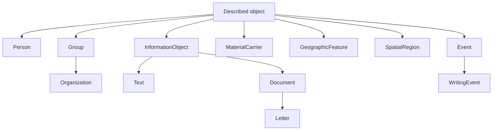
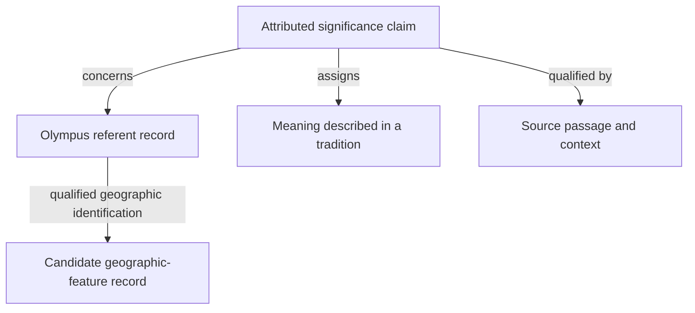

# Model Design

This document consolidates the proposed semantic extensions and wider model
requirements. Its routing question is what the model should distinguish beyond
the bounded executable contracts. These are independent project proposals.
They do not constitute a version 0.3 contract, an official TEI decision, or a
universal ontology of everything a text can describe.

[[knowledge/text-model]] owns the executable 0.1 and 0.2 definitions. In 0.2,
`Text` remains an attributed editorial grouping of versions; names are
represented by bearer-dependent name claims; mentions are typed reading nodes or annotations;
entity kinds form a closed set. The proposals below do not silently change
those records. [[knowledge/identity-evidence]] owns the executable source
qualification profile. [[knowledge/p6-evaluation]] owns the P5 comparison and
compatibility criteria. [[knowledge/ontology]] specifies the documentary
ontology experiment and its separation from this proposed domain model.

## Text across applications

The proposed `Text` is an identifiable unit of linguistic content with an
explicit boundary and identity criterion. A `TextRecord` documents that unit
and the criterion under which it is identified. A `RepresentationRecord`
documents a particular representation state. A separate attributed claim
assigns that representation to the text. This design distinguishes the content
identity from the decision to group representations. It leaves the executable
0.1/0.2 `Text` grouping contract unchanged.

A criterion must explain continuity of linguistic content in the relevant
application. A research purpose alone can justify collection membership without
establishing text identity. Two independent letters can have the same wording;
two transcriptions of one letter can differ in their character sequences. A
corpus can include all four records without treating them as one text.
`CollectionRecord` describes that collection, while `Package` groups records
for exchange. Neither membership relation establishes linguistic continuity.

| Distinction | Consequence |
|---|---|
| Linguistic content and fixed representation | A transcription or normalized representation has its own identity and construction policy. A qualified assignment connects it to a TextRecord. Equal strings do not establish identical sources or text identity. |
| Document and material carrier | A described letter and a physical sheet may require separate identities. A catalogue can describe a document before any transcription exists. |
| Description and described object | A catalogue entry has its own text. It is distinct from the manuscript and the manuscript's linguistic content. |
| Collection and text continuity | Corpus or archival collection membership has a separate relation from representation assignment and text continuity. |
| Annotation and representation | Tokenization may add analysis to an unchanged representation. It need not create a new character sequence. |

Current `Version` remains a fixed finite Unicode sequence with frozen technical
parents. A work, witness, transcription task, historical transmission relation,
and technical parentage require separately stated connections. Positive
continuity remains attributed; missing membership implies no exclusion.
Physical, image, audio, token, and grapheme coordinates require later contracts.

## Referents, names, mentions, and claims

The design separates the documentary identity of a record from the object it
describes. A `ReferentRecord` is a handle for a referential intention, including
an unresolved or narrative referent. Its expected referent type is revisable.
Correcting an initial interpretation from person to organization need not
replace the handle when the same referential intention is being reconsidered.
A record's display label establishes no name assignment or external identity.
An external identification requires a qualified relation with a stated meaning.

The following hierarchy proposes domain types for described objects. It is a
partial hierarchy, with arrows from broader to narrower type. It imposes no
exhaustive partition or global disjointness. `Document` here describes an
information object; its material carrier requires a separate relationship.

These domain edges are distinct from the documentary subclasses in the
generated [record hierarchy](../ontology/record-hierarchy.mmd). A record
describing a person remains a `ReferentRecord`; the domain proposal adds no
Person superclass to that record. [[knowledge/ontology]] owns the formal
record definitions. The six executable entity kinds retain their 0.2 meaning.

A `NameFormRecord` independently identifies a documented linguistic form. It
carries spelling, language and script where known, and optionally ordered
components. It can be recorded before any bearer has been identified. Nested
or ambiguous components may need their own identity and claims. Equal spelling
does not establish either record identity or bearer identity.

Person name, place name and organization name classify a naming use or its
interpretation. They are not intrinsic subclasses of the form record. The
form `Victoria` can be used for a person, a ship or a place. A name mention
records an occurrence; a name assignment describes the use of a form for a
bearer within a context. These are distinct from a proposed `Name` identity
that groups several forms. Such a grouping would need its own criterion and
grounds, for example a documented treatment as variants of one name. The
initial documentary core requires only the independent form record.

Name correspondence, translation, and editorial normalization require typed
relations with their own grounds. Being an official name, pseudonym, or preferred
display name belongs to a name assignment within a relevant period, community,
or project. A role used inside a name stays distinct from a role held by its
bearer.

| Proposed proposition role | Subject and content |
|---|---|
| Denotation | A mention denotes a specified referent. Competing identifications can coexist. |
| Name assignment | A referent bears a particular name form in the stated context; use type and naming status qualify that assignment. |
| Name realization | A textual name mention realizes a particular name form. |
| Classification | An object receives a defined concept along a stated dimension. |
| Alignment | An identified object is related to an external record under an explicit mapping relation. |

These proposition roles can share one structured content pattern. They do not
require a new record subclass for every predicate. A `PropositionRecord`
identifies the specified content and its interpretation context. A
`ClaimRecord` records an agent's stance toward that content, with its source
support and lifecycle. `assert`, `report`, `question` and `deny` distinguish
different stances. Withdrawal concerns the claim's lifecycle and does not
assert the negation of its content. Two agents can assert and deny the same
proposition; another can report its occurrence in a source without endorsing
it.

An `AnnotationRecord` connects a selected target to a body, which can reference
a proposition or claim. Its target identifies the annotated occurrence and can
differ from the passage supporting the interpretation. A `MentionRecord`
specializes annotation for a referring expression. Classifying that expression
as a name and identifying its bearer remain separate judgments.

Every predicate defines its argument interpretation explicitly. The controlled
modes `record`, `referent`, `concept` and `proposition` distinguish the record
itself, its described object, a vocabulary value and a recorded content. A name
assignment reads its subject as a described referent and its object as a
documented form. A relation recording the revision of a claim concerns the
record itself. An unfamiliar predicate licenses no external interpretation.

A compact authoring form may inline proposition fields within a claim. Direct
property syntax for a substantive assertion is shorthand only when a declared
profile supplies its context, stance and responsibility and specifies a
deterministic expansion. Documentary construction fields retain their own
record contracts. An importer records its own responsibility where applicable;
it must not invent an absent historical author, assessment or date. Expansion
preserves qualification and reference identity. It establishes no semantic
equivalence between differently formulated propositions.

Responsibility, creation time, validity, uncertainty and source support retain
their separate meanings. Their treatment here is a proposed successor design;
the existing 0.1/0.2 claim pattern remains the bounded executable contract.

An unresolved mention may still be classified as a presumed person name without
minting a fictitious identified person. Existing 0.2 already permits mentions
without denotation. Independent name forms and a structured anticipated
referent type on such mentions exceed that contract. Text selections remain
bound to a fixed representation. Identifying an occurrence and resolving its
location are separate operations. Whether a byname functions as a proper name
or a description can itself be an attributed, uncertain classification.

## Open classifications

Fundamental classes need justified identity criteria or rules. Organization
activity, purpose, and organizational form are separate, repeatable dimensions
whose values are defined concepts from extensible vocabularies. For example,
one organization can have both education and culture as activities, association
as its organizational form, and scholarly exchange as its purpose. A closed
subclass list of educational, commercial, cultural, and political organizations
would prematurely restrict that description.

Person and Organization are proposed domain types. Writer, recipient, member
and editor are roles held in a particular activity or relationship. A person
can cease to be an editor without losing person identity; an organization can
change its activities while remaining the same organization. Roles therefore
require a bearer and their relevant context. A name component such as a title
does not by itself establish that its bearer held the corresponding role.

An interface can expose these relationships as attributes. A vocabulary may
organize their values hierarchically without making every value a fundamental
class. A classification can carry a period, source, and responsible assessment.
Subclassing is justified when a specialization introduces identity conditions
or applicable rules. The existing 0.2 `kind` field retains its fixed contract;
this proposal concerns a later domain and classification design.

## Historical and narrated places

A place description uses a `ReferentRecord` with an attributed or expected
place classification. Its documentary identity permits discussion before a
geographic counterpart is identified. An IRI by itself establishes no physical
existence; class definitions, property meanings and claim scope determine the
commitments of a description. The local record therefore acquires no external
geographic class through its label or expected type.

Relations to geographic features, spatial extents, settlements and political
bodies require explicit interpretation. A country territory and a state
organization may share a name while requiring distinct referents. An
identification claim must distinguish co-reference, proposed geographic
identification and spatial association. An unspecified correspondence relation
cannot authorize an identity merge.

| Dimension | Required distinction |
|---|---|
| Geographic description | Feature type, location, extent, and the basis of their identification. |
| History | Existence, names, use, and extent during specified periods. Source date and the date described are separate. |
| Cultural or religious significance | A meaning attributed within a community, tradition, or source. Religious context alone supplies no fictionality classification. |
| Narrative context | The discourse or world in which a place and its events are described. |
| Knowledge and assessment | Source reports, uncertainty, scholarly interpretations, and competing geographic identification hypotheses. |

An unknown location does not imply fictionality. Historical attestation does not
imply that a place has disappeared. One current coordinate cannot adequately
stand for every historical extent or a source's uncertain localization.
Changing boundaries or names need dated descriptions and may leave place
identity intact under the declared criterion. Missing temporal bounds express
missing information; they do not establish existence throughout all time.

The user's Olympus example tests whether one geographically identified mountain
can receive historical and religious descriptions without multiplying its
identity for each classification. A passage describing a divine realm may
require a separate referent if its connection to the mountain is uncertain.
Shared naming alone does not resolve that connection.
Two documentary records may describe the same mountain. Keeping their record
identities separate permits review of the identification without multiplying
the mountain itself. A proposed relation between a narrative setting and a
geographic feature must state how their descriptions are being compared.

Atlantis tests a referent established within a specified narrative even when no
geographic counterpart is accepted. A source's description as an island, its
narrated destruction, a scholarly assessment as literary construction, and a
proposed geographic identification are separate claims. This example specifies
model obligations; it makes no historical finding about Atlantis or Olympus.

A Boolean `fictional` cannot preserve all these distinctions. A context needs
both an addressable identity and a structured scope kind with defined processing
consequences. A source report identifies the source passage being reported; a
narrative context identifies the described discourse or world; an assessment
context identifies the interpretation under review. Claim stance operates
separately from these scopes. Asserting what happens in a narrative does not
promote its content to a geographic-world assertion.

Queries and exports must retain context and stance, produce a declared
projection, or reject a requested transformation they cannot preserve. Neither
matching labels nor selecting one context licenses unqualified world facts.
Nested reports, cross-context identification and temporal uncertainty require
further processing contracts. The ontology core records the distinctions and
does not implement their general inference rules.

## Worked example a described letter

[Model Examples](model-examples.md#worked-example-a-described-letter) owns the
exact user-supplied sentence, its annotation diagram, and complete XML, JSON,
and RDF examples. Its separate catalogue also encodes the organization,
Olympus, and Atlantis cases with explicit resource registries and claim scopes.
The examples are illustrative design syntax. They introduce no implemented
binding or new model version.

## Ontology comparison leads

These external references are navigation leads from the discussion. They have
not been admitted as new evidence through this document. Any factual premise
about an ontology or P5 used in output must follow the repository's evidence
chain. Compare specific definitions and logical commitments before choosing an
alignment; matching class labels never establish equivalence.

| Reference lead | Question to examine |
|---|---|
| [BFO](https://bfo-ontology.github.io/), [DOLCE](https://www.loa.istc.cnr.it/index.php/dolce/) | Which foundational distinctions suit objects, processes, qualities, and dependencies? |
| [CIDOC CRM](https://cidoc-crm.org/html/cidoc_crm_v7.0.html) | How should information objects, linguistic objects, material carriers, actors, events, and spatial extents align? |
| [LRMoo](https://cidoc-crm.org/extensions/lrmoo/html/LRMoo_v1.1.1.html) | How do work and expression identities relate to the proposed text criteria? |
| [RiC-O](https://www.ica.org/standards/RiC/RiC-O_1-1.html) | How should records, record sets, and instantiations inform archival cases? |
| [NIF](https://persistence.uni-leipzig.org/nlp2rdf/ontologies/nif-core/nif-core.html), [OntoLex-Lemon](https://www.w3.org/2016/05/ontolex/) | Which text-anchor, linguistic annotation, lexical form, and meaning distinctions help corpus and name modeling? |
| [W3C ORG](https://www.w3.org/TR/vocab-org/), [SKOS](https://www.w3.org/TR/skos-reference/) | How should extensible organizational classifications and concept schemes work? |
| [Web Annotation](https://www.w3.org/TR/annotation-model/), [PROV-O](https://www.w3.org/TR/prov-o/) | Which targeting and provenance constructs can be reused? |
| [Pleiades overview](https://pleiades.stoa.org/help/conceptual-overview), [technical introduction](https://pleiades.stoa.org/help/technical-intro-places), [RDF vocabulary](https://pleiades.stoa.org/help/pleiades-rdf-vocabulary) | How should place identity, mythical referents, names, uncertain locations, historical periods, and RDF publication interact? |

These serve different modeling functions. A comparison must record adoption,
specialization, partial mapping, incompatibility, or a justified local extension.
The experimental [alignment register](../ontology/alignment-candidates.ttl)
records candidate comparisons under [[knowledge/ontology]]. Its entries add no
import, equivalence, subclass or identity axioms. Activating a bridge requires
a specified task and inspected target definitions, followed by positive and
adverse examples. No combined import of all these ontologies is proposed.

The case-specific primary leads are [UNESCO's Olympus description](https://whc.unesco.org/en/list/1719/),
[Plato's Timaeus 25](https://www.perseus.tufts.edu/hopper/text?doc=Perseus%3Atext%3A1999.01.0180%3Atext%3DTim.%3Apage%3D25),
and [Critias 113](https://www.perseus.tufts.edu/hopper/text?doc=Perseus%3Atext%3A1999.01.0180%3Atext%3DCriti.%3Apage%3D113).
They identify passages to inspect and admit before making source-backed claims
about the geographic, religious, or narrative examples. Discussion of these
webpages and their listing here establish no source-admission or verification
status.

## Modeling levels

| Level | Responsibility |
|---|---|
| Metamodel | Defines expressible constructs such as concept, property, relation, sequence, and constraint. |
| Domain model | Defines shared TEI concepts such as paragraph, person, witness, reading, and annotation. |
| Blueprint | Selects and constrains a coherent usage contract, such as scholarly text, dictionary, or manuscript description. |
| Instance | Records a particular object through nodes, text, values, links, spans, and declarations. |

A declared project customization between blueprint and instance records its
restrictions, extensions, aliases, and conflict resolutions. Shared concept
meanings cannot change silently. [[knowledge/p6-architecture]] owns the
architecture and customization proposal; this table identifies the semantic
responsibilities of its modeling levels.

## Structural and conformance requirements

The [real HSA letter case](../experiments/hsa_letter_4493/README.md) gives
these requirements a bounded source test. Its working rule separates the
letter's projected character data from editorial note representations and
preserves each insertion point. An insertion point does not settle the full
semantic target of a note. Recorded manuscript origin, author attribution,
correspondence role and signature reference retain their different contexts.
Uninterpreted P5 markup stays explicitly distinguishable from semantic
mapping. Source-byte preservation alone supplies no semantic roundtrip.
The maintained mapping and binding contract is [[knowledge/hsa-profile]].

The earlier wider sketch remains a candidate for comparison with a primary tree
plus references and annotations. Its primitives are concepts with versioned
definitions; typed nodes; typed properties; textual sequences; ordered content
occurrences; named containment hierarchies; directed or undirected relations;
anchored spans; named constraints; and declarations of model, blueprint,
language, version, and binding context.

A proposed node can instantiate several compatible concepts. Properties attach
typed values to nodes or relations. Textual units have immutable or versioned
sequences; content sequences order occurrences of text items, nodes, or
references. The wider span denotes a contiguous region in a declared sequence
or version. Other selection structures must remain distinguishable from that
primitive. Experiments must determine which distinctions need separate
primitives and which a domain profile can adequately compose.

The earlier notation `I = (D, N, X, Q, H, R, S, V)` names declarations, typed
nodes, text segments, content sequences, hierarchies, relations, spans, and
typed property values. It is a checklist of reconstructible components. Its
necessity and sufficiency remain open.

| Area | Requirement retained from the wider sketch |
|---|---|
| Scope | Preserve ordered content, metadata, containment, references, overlap, annotation, and graph relations; support declared domain restrictions and extensions independently of syntax. |
| Order and mixed content | Declare meaningful sequences and whether repeated references create distinct occurrences. JSON member order, RDF triple order, XML attribute order, and YAML map order carry no accidental semantics. |
| Containment | Name each hierarchy; constrain its parent/child relations and consistency with sequence membership. A preferred serialization tree does not settle other readings. Multi-hierarchy membership requires explicit rules. |
| Selection and change | Distinguish points, contiguous and discontinuous extents, plural targets, and unresolved choices. Declare position units, version identity, repeated occurrences, and asserted versus computed cross-version correspondence. |
| Stand-off mapping | Preserve target, scope, and interpretation when moving inline annotation into a separate claim. Proper nesting alone does not establish equivalence. |
| Identity and references | Keep canonical identity independent of labels, paths, local syntax keys, and namespace prefixes. Declare resolution context and distinguish missing, incompatible, and unchecked targets. Cycles fail only an applicable prohibition. |
| Properties | Define domain, range, cardinality, ordering, defaults, and literal/reference/structured value distinctions. Give language-tagged strings, dates, measures, uncertainty, and vocabularies explicit semantics. |
| Normalization | Declare line-ending, Unicode, and whitespace policies. Classify lexical features such as entity references by semantic, binding, or preservation role. Preserve explicit versus inferred values when relevant. |
| Constraints | Give each rule identity, rationale, scope, severity, condition, and diagnostic. Declare relevant hierarchy, ancestry, neighbors, relations, and dependencies. Distinguish violations, warnings, and informative normalizations. |
| Validation | Check unique identity, complete declarations, reference resolution, deterministic order, graph rules, and value rules at their applicable layer. Customization cannot weaken designated non-overridable core rules. Binding limits cannot silently weaken model semantics. |

In 0.1 the nearest realizations are local `Concept`, `Reading node`, `Version`,
`Reading`, `Relation`, and `Selection`. Concepts have one local role; reading
nodes have one type and contiguous extent; readings are attributed forests over
one version; relations are directed; selections have richer resolution modes
than the sketch's span. No generic property, content-sequence, or constraint
records are implemented. Package `model_version` and XML `binding_version`
provide only part of the proposed declaration context. Agent, Text, continuity
claim, and annotation have explicit records beyond the earlier primitive list.

Bindings must preserve an independently specified comparison relation and report
normalizations and losses under [the serialization contract](text-model.md#12-serialization-and-conformance).
The formal language, generalized identity rules, position systems, defaults,
hierarchy composition, ontology alignments, and customization algebra remain
open beyond the bounded contracts. Their adoption requires P5 cases and
counterexamples under [[knowledge/p6-evaluation]], including corpus and catalogue
workflows and a simple authoring path whose internal claim objects need not all
be entered manually.
