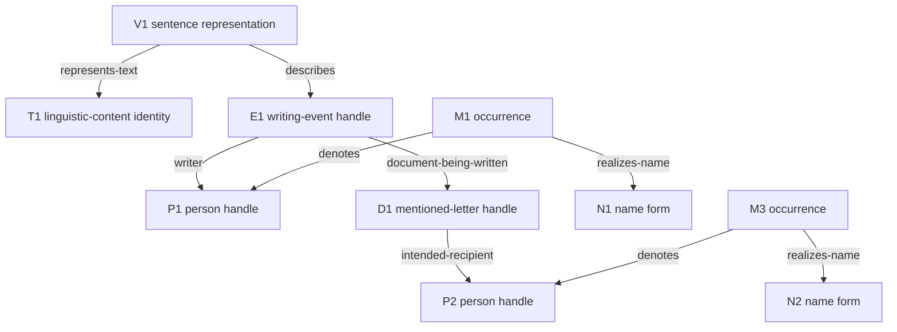

# Model Examples

The six cases apply [[knowledge/model-design]] through complete XML, JSON and
RDF views. They are illustrative design records with their own explicit
contract. They establish no TEI syntax, 0.3 package version, historical finding
or conversion to the executable 0.1/0.2 models. The documentary vocabulary in
[[knowledge/ontology]] has its own namespace and remains a separate experiment.

The [real HSA letter case](../experiments/hsa_letter_4493/README.md) applies
that documentary ontology to an admitted P5 source through a separate,
reproducible case profile. It includes the whole letter and its editorial
notes. Its XML/JSON/RDF contract is maintained in [[knowledge/hsa-profile]] and does not change
the six illustrative envelopes below.

## Illustrative envelope

Each package identifies its authoring agent and three unordered collections.
Resources describe textual and documentary objects, propositions record
structured content, and claims record an agent's stance toward that content.
All identifiers and references have package-local scope.

| Component | Required interpretation |
|---|---|
| `ReferentRecord` | A documentary handle for an intended referent. `expectedReferentType` is a revisable expectation. The record is not itself a person or place. |
| `TextRecord` | Documents a particular linguistic-content identity with an explicit `criterion`. Arbitrary collection membership supplies no such identity. |
| `RepresentationRecord` | Fixed `content`, `language` and construction `origin`. Selections refer to this exact representation. |
| `NameFormRecord` | Independently addressable `form` and `language`. A form does not have an intrinsic person-name or place-name type. |
| `SelectionRecord` | `version` reference, zero-based half-open Unicode code-point `start` and `end`, and an exact matching `quote`. |
| `MentionRecord`, `AnnotationRecord` | A `selection` identifies the interpreted occurrence. An annotation may reference a `claim`. A mention's referent and name-use category are separate propositions. |
| `ContextRecord` | A `source` reference and machine-readable `scope` frame the content. `contextType` and `description` explain the particular case. |
| `PredicateDefinition` | A defined relation with explicit `subjectInterpretation` and `objectInterpretation`. |
| Proposition | `id`, `subject`, `predicate`, `object`, `context`, optional `evidence`. Its presence does not endorse its content. |
| Claim | `id`, `proposition`, `agent`, `stance`, `lifecycle`. `assert`, `report`, `question` and `deny` are attitudes to content; `active` and `withdrawn` are lifecycle values. |

Predicate argument modes have four defined values. `record` reads the
identified documentary record and its declared content fields. `referent`
concerns the intended object of a ReferentRecord. `concept` reads the defined
vocabulary value. `proposition` reads an identified structured content. A name
assignment's object is a NameFormRecord providing the assigned form; it makes
no identity claim between that record and an external linguistic object.
Unknown predicates have no licensed interpretation outside this envelope.

Resource fields `version`, `selection`, `source` and `claim` are references.
`start` and `end` are integers, and other resource fields after `id` are string
literals. All proposition fields after `id` are references. Claim fields
`proposition` and `agent` are references; `stance` and `lifecycle` are literals.
The package agent documents example construction. Each claim declares its own
responsibility explicitly.

Proposition `evidence` identifies the selected source passage for that recorded
content. Reusing the proposition does not make this passage a justification
for every agent's stance. Separate reasons or evidence for individual claims,
such as a counter-source for denial, remain outside this small envelope and
require a further source-attribution contract.

XML uses attributes for these fields and decodes the two integer attributes as
integers. JSON carries the same records. RDF uses the illustrative namespace
`https://example.org/tei-design/` as `d:` and case-specific IRIs under
`https://example.org/tei-design/cases/{package-id}/` as `ex:`. It declares
`d:Example`, `d:Resource`, `d:Proposition` and `d:Claim` record roles and
`hasResource`, `hasProposition` and `hasClaim` memberships. Field predicates
carry reference IRIs or literals according to the rules above.

The source scopes are `text-interpretation`, `constructed-scenario`,
`geographic-hypothesis`, `tradition-report`, `narrative` and `assessment`.
Choosing one filters the recorded content; it never promotes that content to
an unqualified world fact. Reporting does not endorse, questioning does not
assert, and withdrawing does not deny. Even assertion retains its declared
context. RDF is used to describe these distinctions, not to evaluate truth.

## Worked example a described letter

> Christopher Pollin schreibt einen Brief an Martina Scholger.

The user-supplied sentence supplies no biographical evidence. V1 represents
this sentence's linguistic content T1. D1 identifies the mentioned letter,
whose own text is not supplied. Six selections locate the complete sentence,
the three mentions, the writing predicate and the overlapping recipient phrase.
N1 and N2 provide name forms; the person-name classification concerns their
use at M1 and M3. Each content has a separate attributed claim.



The arrows abbreviate context-qualified proposition contents. Claim records
supply stance and responsibility. Writing alone establishes no completion,
sending or receipt. The annotation agent is distinct from the event's writer.
The bounded 0.2 model can approximate some referents and relationships, but its
bearer-dependent name claims, statement records and RDF export do not implement
this envelope's independent forms, propositions, stances and argument modes.

## Complete case serializations

### Sentence

The complete sentence interpretation distinguishes linguistic content, its fixed representation, the described event, names, mentions, contextual name-use classification and the intended recipient.

```xml
<example xmlns="https://example.org/tei-design/" id="letter-example" agent="illustrator">
  <resources>
    <resource id="illustrator" kind="AgentRecord" description="Responsible for this constructed annotation example; no historical attribution."/>
    <resource id="V1" kind="RepresentationRecord" content="Christopher Pollin schreibt einen Brief an Martina Scholger." language="de" origin="User-supplied illustrative sentence."/>
    <resource id="T1" kind="TextRecord" criterion="The linguistic content of this particular supplied sentence occurrence; an independent identical sentence is not identified by string equality."/>
    <resource id="ctx-letter" kind="ContextRecord" contextType="illustrative-text-interpretation" source="V1" description="Interpret the supplied sentence; no historical truth, completion, sending, or receipt is established." scope="text-interpretation"/>
    <resource id="P1" kind="ReferentRecord" label="Christopher Pollin" expectedReferentType="person"/>
    <resource id="P2" kind="ReferentRecord" label="Martina Scholger" expectedReferentType="person"/>
    <resource id="D1" kind="ReferentRecord" label="The mentioned letter" expectedReferentType="document"/>
    <resource id="E1" kind="ReferentRecord" label="The described writing event" expectedReferentType="writing-event"/>
    <resource id="N1" kind="NameFormRecord" form="Christopher Pollin" language="und"/>
    <resource id="N2" kind="NameFormRecord" form="Martina Scholger" language="und"/>
    <resource id="S-full" kind="SelectionRecord" version="V1" start="0" end="60" quote="Christopher Pollin schreibt einen Brief an Martina Scholger."/>
    <resource id="S-M1" kind="SelectionRecord" version="V1" start="0" end="18" quote="Christopher Pollin"/>
    <resource id="S-predicate" kind="SelectionRecord" version="V1" start="19" end="27" quote="schreibt"/>
    <resource id="S-M2" kind="SelectionRecord" version="V1" start="28" end="39" quote="einen Brief"/>
    <resource id="S-M3" kind="SelectionRecord" version="V1" start="43" end="59" quote="Martina Scholger"/>
    <resource id="S-recipient" kind="SelectionRecord" version="V1" start="40" end="59" quote="an Martina Scholger"/>
    <resource id="M1" kind="MentionRecord" mentionType="name" selection="S-M1"/>
    <resource id="M2" kind="MentionRecord" mentionType="description" selection="S-M2"/>
    <resource id="M3" kind="MentionRecord" mentionType="name" selection="S-M3"/>
    <resource id="predicate-annotation" kind="AnnotationRecord" selection="S-predicate" claim="L01" description="Marks the writing predicate; the full sentence supports its interpreted participants."/>
    <resource id="recipient-annotation" kind="AnnotationRecord" selection="S-recipient" claim="L11" description="Marks the intended-recipient construction; overlaps the name mention."/>
    <resource id="describes" kind="PredicateDefinition" definition="The source representation is interpreted as describing the event identified by the object record." subjectInterpretation="record" objectInterpretation="referent"/>
    <resource id="denotes" kind="PredicateDefinition" definition="The selected mention is interpreted as referring to the object identified by the referent record." subjectInterpretation="record" objectInterpretation="referent"/>
    <resource id="realizes-name" kind="PredicateDefinition" definition="The selected name mention realizes the form identified by the name record." subjectInterpretation="record" objectInterpretation="record"/>
    <resource id="bears-name" kind="PredicateDefinition" definition="The referent is assigned the identified name form within the claim context." subjectInterpretation="referent" objectInterpretation="record"/>
    <resource id="writer" kind="PredicateDefinition" definition="The event description assigns the writing role to the identified person referent." subjectInterpretation="referent" objectInterpretation="referent"/>
    <resource id="document-being-written" kind="PredicateDefinition" definition="The event description identifies the document in the process of being written." subjectInterpretation="referent" objectInterpretation="referent"/>
    <resource id="intended-recipient" kind="PredicateDefinition" definition="The document description assigns the intended recipient role; it asserts no receipt." subjectInterpretation="referent" objectInterpretation="referent"/>
    <resource id="represents-text" kind="PredicateDefinition" definition="Assigns this fixed representation to the linguistic-content identity documented by the TextRecord, under the declared identity criterion." subjectInterpretation="record" objectInterpretation="record"/>
    <resource id="person-name-use" kind="ConceptDefinition" definition="Use of a name form to refer to a person in this interpreted occurrence."/>
    <resource id="name-use-type" kind="PredicateDefinition" definition="Classifies the name use at an identified mention within the stated interpretation context." subjectInterpretation="record" objectInterpretation="concept"/>
  </resources>
  <propositions>
    <proposition id="content-L01" subject="V1" predicate="describes" object="E1" context="ctx-letter" evidence="S-full"/>
    <proposition id="content-L02" subject="M1" predicate="denotes" object="P1" context="ctx-letter" evidence="S-full"/>
    <proposition id="content-L03" subject="M1" predicate="realizes-name" object="N1" context="ctx-letter" evidence="S-full"/>
    <proposition id="content-L04" subject="P1" predicate="bears-name" object="N1" context="ctx-letter" evidence="S-full"/>
    <proposition id="content-L05" subject="M3" predicate="denotes" object="P2" context="ctx-letter" evidence="S-full"/>
    <proposition id="content-L06" subject="M3" predicate="realizes-name" object="N2" context="ctx-letter" evidence="S-full"/>
    <proposition id="content-L07" subject="P2" predicate="bears-name" object="N2" context="ctx-letter" evidence="S-full"/>
    <proposition id="content-L08" subject="M2" predicate="denotes" object="D1" context="ctx-letter" evidence="S-full"/>
    <proposition id="content-L09" subject="E1" predicate="writer" object="P1" context="ctx-letter" evidence="S-full"/>
    <proposition id="content-L10" subject="E1" predicate="document-being-written" object="D1" context="ctx-letter" evidence="S-full"/>
    <proposition id="content-L11" subject="D1" predicate="intended-recipient" object="P2" context="ctx-letter" evidence="S-full"/>
    <proposition id="content-L12" subject="V1" predicate="represents-text" object="T1" context="ctx-letter" evidence="S-full"/>
    <proposition id="content-L13" subject="M1" predicate="name-use-type" object="person-name-use" context="ctx-letter" evidence="S-full"/>
    <proposition id="content-L14" subject="M3" predicate="name-use-type" object="person-name-use" context="ctx-letter" evidence="S-full"/>
  </propositions>
  <claims>
    <claim id="L01" proposition="content-L01" agent="illustrator" stance="assert" lifecycle="active"/>
    <claim id="L02" proposition="content-L02" agent="illustrator" stance="assert" lifecycle="active"/>
    <claim id="L03" proposition="content-L03" agent="illustrator" stance="assert" lifecycle="active"/>
    <claim id="L04" proposition="content-L04" agent="illustrator" stance="assert" lifecycle="active"/>
    <claim id="L05" proposition="content-L05" agent="illustrator" stance="assert" lifecycle="active"/>
    <claim id="L06" proposition="content-L06" agent="illustrator" stance="assert" lifecycle="active"/>
    <claim id="L07" proposition="content-L07" agent="illustrator" stance="assert" lifecycle="active"/>
    <claim id="L08" proposition="content-L08" agent="illustrator" stance="assert" lifecycle="active"/>
    <claim id="L09" proposition="content-L09" agent="illustrator" stance="assert" lifecycle="active"/>
    <claim id="L10" proposition="content-L10" agent="illustrator" stance="assert" lifecycle="active"/>
    <claim id="L11" proposition="content-L11" agent="illustrator" stance="assert" lifecycle="active"/>
    <claim id="L12" proposition="content-L12" agent="illustrator" stance="assert" lifecycle="active"/>
    <claim id="L13" proposition="content-L13" agent="illustrator" stance="assert" lifecycle="active"/>
    <claim id="L14" proposition="content-L14" agent="illustrator" stance="assert" lifecycle="active"/>
  </claims>
</example>
```

```json
{
  "id": "letter-example",
  "agent": "illustrator",
  "resources": [
    {"id":"illustrator","kind":"AgentRecord","description":"Responsible for this constructed annotation example; no historical attribution."},
    {"id":"V1","kind":"RepresentationRecord","content":"Christopher Pollin schreibt einen Brief an Martina Scholger.","language":"de","origin":"User-supplied illustrative sentence."},
    {"id":"T1","kind":"TextRecord","criterion":"The linguistic content of this particular supplied sentence occurrence; an independent identical sentence is not identified by string equality."},
    {"id":"ctx-letter","kind":"ContextRecord","contextType":"illustrative-text-interpretation","source":"V1","description":"Interpret the supplied sentence; no historical truth, completion, sending, or receipt is established.","scope":"text-interpretation"},
    {"id":"P1","kind":"ReferentRecord","label":"Christopher Pollin","expectedReferentType":"person"},
    {"id":"P2","kind":"ReferentRecord","label":"Martina Scholger","expectedReferentType":"person"},
    {"id":"D1","kind":"ReferentRecord","label":"The mentioned letter","expectedReferentType":"document"},
    {"id":"E1","kind":"ReferentRecord","label":"The described writing event","expectedReferentType":"writing-event"},
    {"id":"N1","kind":"NameFormRecord","form":"Christopher Pollin","language":"und"},
    {"id":"N2","kind":"NameFormRecord","form":"Martina Scholger","language":"und"},
    {"id":"S-full","kind":"SelectionRecord","version":"V1","start":0,"end":60,"quote":"Christopher Pollin schreibt einen Brief an Martina Scholger."},
    {"id":"S-M1","kind":"SelectionRecord","version":"V1","start":0,"end":18,"quote":"Christopher Pollin"},
    {"id":"S-predicate","kind":"SelectionRecord","version":"V1","start":19,"end":27,"quote":"schreibt"},
    {"id":"S-M2","kind":"SelectionRecord","version":"V1","start":28,"end":39,"quote":"einen Brief"},
    {"id":"S-M3","kind":"SelectionRecord","version":"V1","start":43,"end":59,"quote":"Martina Scholger"},
    {"id":"S-recipient","kind":"SelectionRecord","version":"V1","start":40,"end":59,"quote":"an Martina Scholger"},
    {"id":"M1","kind":"MentionRecord","mentionType":"name","selection":"S-M1"},
    {"id":"M2","kind":"MentionRecord","mentionType":"description","selection":"S-M2"},
    {"id":"M3","kind":"MentionRecord","mentionType":"name","selection":"S-M3"},
    {"id":"predicate-annotation","kind":"AnnotationRecord","selection":"S-predicate","claim":"L01","description":"Marks the writing predicate; the full sentence supports its interpreted participants."},
    {"id":"recipient-annotation","kind":"AnnotationRecord","selection":"S-recipient","claim":"L11","description":"Marks the intended-recipient construction; overlaps the name mention."},
    {"id":"describes","kind":"PredicateDefinition","definition":"The source representation is interpreted as describing the event identified by the object record.","subjectInterpretation":"record","objectInterpretation":"referent"},
    {"id":"denotes","kind":"PredicateDefinition","definition":"The selected mention is interpreted as referring to the object identified by the referent record.","subjectInterpretation":"record","objectInterpretation":"referent"},
    {"id":"realizes-name","kind":"PredicateDefinition","definition":"The selected name mention realizes the form identified by the name record.","subjectInterpretation":"record","objectInterpretation":"record"},
    {"id":"bears-name","kind":"PredicateDefinition","definition":"The referent is assigned the identified name form within the claim context.","subjectInterpretation":"referent","objectInterpretation":"record"},
    {"id":"writer","kind":"PredicateDefinition","definition":"The event description assigns the writing role to the identified person referent.","subjectInterpretation":"referent","objectInterpretation":"referent"},
    {"id":"document-being-written","kind":"PredicateDefinition","definition":"The event description identifies the document in the process of being written.","subjectInterpretation":"referent","objectInterpretation":"referent"},
    {"id":"intended-recipient","kind":"PredicateDefinition","definition":"The document description assigns the intended recipient role; it asserts no receipt.","subjectInterpretation":"referent","objectInterpretation":"referent"},
    {"id":"represents-text","kind":"PredicateDefinition","definition":"Assigns this fixed representation to the linguistic-content identity documented by the TextRecord, under the declared identity criterion.","subjectInterpretation":"record","objectInterpretation":"record"},
    {"id":"person-name-use","kind":"ConceptDefinition","definition":"Use of a name form to refer to a person in this interpreted occurrence."},
    {"id":"name-use-type","kind":"PredicateDefinition","definition":"Classifies the name use at an identified mention within the stated interpretation context.","subjectInterpretation":"record","objectInterpretation":"concept"}
  ],
  "propositions": [
    {"id":"content-L01","subject":"V1","predicate":"describes","object":"E1","context":"ctx-letter","evidence":"S-full"},
    {"id":"content-L02","subject":"M1","predicate":"denotes","object":"P1","context":"ctx-letter","evidence":"S-full"},
    {"id":"content-L03","subject":"M1","predicate":"realizes-name","object":"N1","context":"ctx-letter","evidence":"S-full"},
    {"id":"content-L04","subject":"P1","predicate":"bears-name","object":"N1","context":"ctx-letter","evidence":"S-full"},
    {"id":"content-L05","subject":"M3","predicate":"denotes","object":"P2","context":"ctx-letter","evidence":"S-full"},
    {"id":"content-L06","subject":"M3","predicate":"realizes-name","object":"N2","context":"ctx-letter","evidence":"S-full"},
    {"id":"content-L07","subject":"P2","predicate":"bears-name","object":"N2","context":"ctx-letter","evidence":"S-full"},
    {"id":"content-L08","subject":"M2","predicate":"denotes","object":"D1","context":"ctx-letter","evidence":"S-full"},
    {"id":"content-L09","subject":"E1","predicate":"writer","object":"P1","context":"ctx-letter","evidence":"S-full"},
    {"id":"content-L10","subject":"E1","predicate":"document-being-written","object":"D1","context":"ctx-letter","evidence":"S-full"},
    {"id":"content-L11","subject":"D1","predicate":"intended-recipient","object":"P2","context":"ctx-letter","evidence":"S-full"},
    {"id":"content-L12","subject":"V1","predicate":"represents-text","object":"T1","context":"ctx-letter","evidence":"S-full"},
    {"id":"content-L13","subject":"M1","predicate":"name-use-type","object":"person-name-use","context":"ctx-letter","evidence":"S-full"},
    {"id":"content-L14","subject":"M3","predicate":"name-use-type","object":"person-name-use","context":"ctx-letter","evidence":"S-full"}
  ],
  "claims": [
    {"id":"L01","proposition":"content-L01","agent":"illustrator","stance":"assert","lifecycle":"active"},
    {"id":"L02","proposition":"content-L02","agent":"illustrator","stance":"assert","lifecycle":"active"},
    {"id":"L03","proposition":"content-L03","agent":"illustrator","stance":"assert","lifecycle":"active"},
    {"id":"L04","proposition":"content-L04","agent":"illustrator","stance":"assert","lifecycle":"active"},
    {"id":"L05","proposition":"content-L05","agent":"illustrator","stance":"assert","lifecycle":"active"},
    {"id":"L06","proposition":"content-L06","agent":"illustrator","stance":"assert","lifecycle":"active"},
    {"id":"L07","proposition":"content-L07","agent":"illustrator","stance":"assert","lifecycle":"active"},
    {"id":"L08","proposition":"content-L08","agent":"illustrator","stance":"assert","lifecycle":"active"},
    {"id":"L09","proposition":"content-L09","agent":"illustrator","stance":"assert","lifecycle":"active"},
    {"id":"L10","proposition":"content-L10","agent":"illustrator","stance":"assert","lifecycle":"active"},
    {"id":"L11","proposition":"content-L11","agent":"illustrator","stance":"assert","lifecycle":"active"},
    {"id":"L12","proposition":"content-L12","agent":"illustrator","stance":"assert","lifecycle":"active"},
    {"id":"L13","proposition":"content-L13","agent":"illustrator","stance":"assert","lifecycle":"active"},
    {"id":"L14","proposition":"content-L14","agent":"illustrator","stance":"assert","lifecycle":"active"}
  ]
}
```

```turtle
@prefix d: <https://example.org/tei-design/> .
@prefix ex: <https://example.org/tei-design/cases/letter-example/> .

ex:letter-example a d:Example ; d:agent ex:illustrator ;
  d:hasResource ex:illustrator, ex:V1, ex:T1, ex:ctx-letter, ex:P1, ex:P2, ex:D1, ex:E1, ex:N1, ex:N2, ex:S-full, ex:S-M1, ex:S-predicate, ex:S-M2, ex:S-M3, ex:S-recipient, ex:M1, ex:M2, ex:M3, ex:predicate-annotation, ex:recipient-annotation, ex:describes, ex:denotes, ex:realizes-name, ex:bears-name, ex:writer, ex:document-being-written, ex:intended-recipient, ex:represents-text, ex:person-name-use, ex:name-use-type ;
  d:hasProposition ex:content-L01, ex:content-L02, ex:content-L03, ex:content-L04, ex:content-L05, ex:content-L06, ex:content-L07, ex:content-L08, ex:content-L09, ex:content-L10, ex:content-L11, ex:content-L12, ex:content-L13, ex:content-L14 ;
  d:hasClaim ex:L01, ex:L02, ex:L03, ex:L04, ex:L05, ex:L06, ex:L07, ex:L08, ex:L09, ex:L10, ex:L11, ex:L12, ex:L13, ex:L14 .

ex:illustrator a d:Resource ; d:kind "AgentRecord" ; d:description "Responsible for this constructed annotation example; no historical attribution." .
ex:V1 a d:Resource ; d:kind "RepresentationRecord" ; d:content "Christopher Pollin schreibt einen Brief an Martina Scholger." ; d:language "de" ; d:origin "User-supplied illustrative sentence." .
ex:T1 a d:Resource ; d:kind "TextRecord" ; d:criterion "The linguistic content of this particular supplied sentence occurrence; an independent identical sentence is not identified by string equality." .
ex:ctx-letter a d:Resource ; d:kind "ContextRecord" ; d:contextType "illustrative-text-interpretation" ; d:source ex:V1 ; d:description "Interpret the supplied sentence; no historical truth, completion, sending, or receipt is established." ; d:scope "text-interpretation" .
ex:P1 a d:Resource ; d:kind "ReferentRecord" ; d:label "Christopher Pollin" ; d:expectedReferentType "person" .
ex:P2 a d:Resource ; d:kind "ReferentRecord" ; d:label "Martina Scholger" ; d:expectedReferentType "person" .
ex:D1 a d:Resource ; d:kind "ReferentRecord" ; d:label "The mentioned letter" ; d:expectedReferentType "document" .
ex:E1 a d:Resource ; d:kind "ReferentRecord" ; d:label "The described writing event" ; d:expectedReferentType "writing-event" .
ex:N1 a d:Resource ; d:kind "NameFormRecord" ; d:form "Christopher Pollin" ; d:language "und" .
ex:N2 a d:Resource ; d:kind "NameFormRecord" ; d:form "Martina Scholger" ; d:language "und" .
ex:S-full a d:Resource ; d:kind "SelectionRecord" ; d:version ex:V1 ; d:start 0 ; d:end 60 ; d:quote "Christopher Pollin schreibt einen Brief an Martina Scholger." .
ex:S-M1 a d:Resource ; d:kind "SelectionRecord" ; d:version ex:V1 ; d:start 0 ; d:end 18 ; d:quote "Christopher Pollin" .
ex:S-predicate a d:Resource ; d:kind "SelectionRecord" ; d:version ex:V1 ; d:start 19 ; d:end 27 ; d:quote "schreibt" .
ex:S-M2 a d:Resource ; d:kind "SelectionRecord" ; d:version ex:V1 ; d:start 28 ; d:end 39 ; d:quote "einen Brief" .
ex:S-M3 a d:Resource ; d:kind "SelectionRecord" ; d:version ex:V1 ; d:start 43 ; d:end 59 ; d:quote "Martina Scholger" .
ex:S-recipient a d:Resource ; d:kind "SelectionRecord" ; d:version ex:V1 ; d:start 40 ; d:end 59 ; d:quote "an Martina Scholger" .
ex:M1 a d:Resource ; d:kind "MentionRecord" ; d:mentionType "name" ; d:selection ex:S-M1 .
ex:M2 a d:Resource ; d:kind "MentionRecord" ; d:mentionType "description" ; d:selection ex:S-M2 .
ex:M3 a d:Resource ; d:kind "MentionRecord" ; d:mentionType "name" ; d:selection ex:S-M3 .
ex:predicate-annotation a d:Resource ; d:kind "AnnotationRecord" ; d:selection ex:S-predicate ; d:claim ex:L01 ; d:description "Marks the writing predicate; the full sentence supports its interpreted participants." .
ex:recipient-annotation a d:Resource ; d:kind "AnnotationRecord" ; d:selection ex:S-recipient ; d:claim ex:L11 ; d:description "Marks the intended-recipient construction; overlaps the name mention." .
ex:describes a d:Resource ; d:kind "PredicateDefinition" ; d:definition "The source representation is interpreted as describing the event identified by the object record." ; d:subjectInterpretation "record" ; d:objectInterpretation "referent" .
ex:denotes a d:Resource ; d:kind "PredicateDefinition" ; d:definition "The selected mention is interpreted as referring to the object identified by the referent record." ; d:subjectInterpretation "record" ; d:objectInterpretation "referent" .
ex:realizes-name a d:Resource ; d:kind "PredicateDefinition" ; d:definition "The selected name mention realizes the form identified by the name record." ; d:subjectInterpretation "record" ; d:objectInterpretation "record" .
ex:bears-name a d:Resource ; d:kind "PredicateDefinition" ; d:definition "The referent is assigned the identified name form within the claim context." ; d:subjectInterpretation "referent" ; d:objectInterpretation "record" .
ex:writer a d:Resource ; d:kind "PredicateDefinition" ; d:definition "The event description assigns the writing role to the identified person referent." ; d:subjectInterpretation "referent" ; d:objectInterpretation "referent" .
ex:document-being-written a d:Resource ; d:kind "PredicateDefinition" ; d:definition "The event description identifies the document in the process of being written." ; d:subjectInterpretation "referent" ; d:objectInterpretation "referent" .
ex:intended-recipient a d:Resource ; d:kind "PredicateDefinition" ; d:definition "The document description assigns the intended recipient role; it asserts no receipt." ; d:subjectInterpretation "referent" ; d:objectInterpretation "referent" .
ex:represents-text a d:Resource ; d:kind "PredicateDefinition" ; d:definition "Assigns this fixed representation to the linguistic-content identity documented by the TextRecord, under the declared identity criterion." ; d:subjectInterpretation "record" ; d:objectInterpretation "record" .
ex:person-name-use a d:Resource ; d:kind "ConceptDefinition" ; d:definition "Use of a name form to refer to a person in this interpreted occurrence." .
ex:name-use-type a d:Resource ; d:kind "PredicateDefinition" ; d:definition "Classifies the name use at an identified mention within the stated interpretation context." ; d:subjectInterpretation "record" ; d:objectInterpretation "concept" .

ex:content-L01 a d:Proposition ; d:subject ex:V1 ; d:predicate ex:describes ; d:object ex:E1 ; d:context ex:ctx-letter ; d:evidence ex:S-full .
ex:content-L02 a d:Proposition ; d:subject ex:M1 ; d:predicate ex:denotes ; d:object ex:P1 ; d:context ex:ctx-letter ; d:evidence ex:S-full .
ex:content-L03 a d:Proposition ; d:subject ex:M1 ; d:predicate ex:realizes-name ; d:object ex:N1 ; d:context ex:ctx-letter ; d:evidence ex:S-full .
ex:content-L04 a d:Proposition ; d:subject ex:P1 ; d:predicate ex:bears-name ; d:object ex:N1 ; d:context ex:ctx-letter ; d:evidence ex:S-full .
ex:content-L05 a d:Proposition ; d:subject ex:M3 ; d:predicate ex:denotes ; d:object ex:P2 ; d:context ex:ctx-letter ; d:evidence ex:S-full .
ex:content-L06 a d:Proposition ; d:subject ex:M3 ; d:predicate ex:realizes-name ; d:object ex:N2 ; d:context ex:ctx-letter ; d:evidence ex:S-full .
ex:content-L07 a d:Proposition ; d:subject ex:P2 ; d:predicate ex:bears-name ; d:object ex:N2 ; d:context ex:ctx-letter ; d:evidence ex:S-full .
ex:content-L08 a d:Proposition ; d:subject ex:M2 ; d:predicate ex:denotes ; d:object ex:D1 ; d:context ex:ctx-letter ; d:evidence ex:S-full .
ex:content-L09 a d:Proposition ; d:subject ex:E1 ; d:predicate ex:writer ; d:object ex:P1 ; d:context ex:ctx-letter ; d:evidence ex:S-full .
ex:content-L10 a d:Proposition ; d:subject ex:E1 ; d:predicate ex:document-being-written ; d:object ex:D1 ; d:context ex:ctx-letter ; d:evidence ex:S-full .
ex:content-L11 a d:Proposition ; d:subject ex:D1 ; d:predicate ex:intended-recipient ; d:object ex:P2 ; d:context ex:ctx-letter ; d:evidence ex:S-full .
ex:content-L12 a d:Proposition ; d:subject ex:V1 ; d:predicate ex:represents-text ; d:object ex:T1 ; d:context ex:ctx-letter ; d:evidence ex:S-full .
ex:content-L13 a d:Proposition ; d:subject ex:M1 ; d:predicate ex:name-use-type ; d:object ex:person-name-use ; d:context ex:ctx-letter ; d:evidence ex:S-full .
ex:content-L14 a d:Proposition ; d:subject ex:M3 ; d:predicate ex:name-use-type ; d:object ex:person-name-use ; d:context ex:ctx-letter ; d:evidence ex:S-full .

ex:L01 a d:Claim ; d:proposition ex:content-L01 ; d:agent ex:illustrator ; d:stance "assert" ; d:lifecycle "active" .
ex:L02 a d:Claim ; d:proposition ex:content-L02 ; d:agent ex:illustrator ; d:stance "assert" ; d:lifecycle "active" .
ex:L03 a d:Claim ; d:proposition ex:content-L03 ; d:agent ex:illustrator ; d:stance "assert" ; d:lifecycle "active" .
ex:L04 a d:Claim ; d:proposition ex:content-L04 ; d:agent ex:illustrator ; d:stance "assert" ; d:lifecycle "active" .
ex:L05 a d:Claim ; d:proposition ex:content-L05 ; d:agent ex:illustrator ; d:stance "assert" ; d:lifecycle "active" .
ex:L06 a d:Claim ; d:proposition ex:content-L06 ; d:agent ex:illustrator ; d:stance "assert" ; d:lifecycle "active" .
ex:L07 a d:Claim ; d:proposition ex:content-L07 ; d:agent ex:illustrator ; d:stance "assert" ; d:lifecycle "active" .
ex:L08 a d:Claim ; d:proposition ex:content-L08 ; d:agent ex:illustrator ; d:stance "assert" ; d:lifecycle "active" .
ex:L09 a d:Claim ; d:proposition ex:content-L09 ; d:agent ex:illustrator ; d:stance "assert" ; d:lifecycle "active" .
ex:L10 a d:Claim ; d:proposition ex:content-L10 ; d:agent ex:illustrator ; d:stance "assert" ; d:lifecycle "active" .
ex:L11 a d:Claim ; d:proposition ex:content-L11 ; d:agent ex:illustrator ; d:stance "assert" ; d:lifecycle "active" .
ex:L12 a d:Claim ; d:proposition ex:content-L12 ; d:agent ex:illustrator ; d:stance "assert" ; d:lifecycle "active" .
ex:L13 a d:Claim ; d:proposition ex:content-L13 ; d:agent ex:illustrator ; d:stance "assert" ; d:lifecycle "active" .
ex:L14 a d:Claim ; d:proposition ex:content-L14 ; d:agent ex:illustrator ; d:stance "assert" ; d:lifecycle "active" .
```


### Organization

One organization handle receives repeatable activity, form and purpose classifications. A change in activity does not itself imply a new organization. These are constructed interpretations without jurisdiction-specific legal claims.

```xml
<example xmlns="https://example.org/tei-design/" id="organization-example" agent="illustrator">
  <resources>
    <resource id="illustrator" kind="AgentRecord" description="Responsible for this constructed annotation example; no historical attribution."/>
    <resource id="organization-scenario" kind="RepresentationRecord" content="A hypothetical association works in education and culture to support scholarly exchange." language="en" origin="Constructed scenario; no real organization is identified."/>
    <resource id="ctx-organization" kind="ContextRecord" contextType="illustrative-classification" source="organization-scenario" description="Records the hypothetical organization's repeatable classifications." scope="constructed-scenario"/>
    <resource id="O1" kind="ReferentRecord" label="Hypothetical organization" expectedReferentType="organization"/>
    <resource id="education" kind="ConceptDefinition" definition="Activity involving teaching or learning."/>
    <resource id="culture" kind="ConceptDefinition" definition="Activity involving cultural production, preservation, or participation."/>
    <resource id="association" kind="ConceptDefinition" definition="An organizational form based on association of members; no jurisdiction-specific legal status is established."/>
    <resource id="scholarly-exchange" kind="ConceptDefinition" definition="Purpose of exchanging scholarly knowledge and methods."/>
    <resource id="activity" kind="PredicateDefinition" definition="Assigns a repeatable activity classification to an organization description." subjectInterpretation="referent" objectInterpretation="concept"/>
    <resource id="organizational-form" kind="PredicateDefinition" definition="Assigns a concept describing the organizational form." subjectInterpretation="referent" objectInterpretation="concept"/>
    <resource id="purpose" kind="PredicateDefinition" definition="Assigns a concept describing the organization's purpose." subjectInterpretation="referent" objectInterpretation="concept"/>
  </resources>
  <propositions>
    <proposition id="content-O01" subject="O1" predicate="activity" object="education" context="ctx-organization"/>
    <proposition id="content-O02" subject="O1" predicate="activity" object="culture" context="ctx-organization"/>
    <proposition id="content-O03" subject="O1" predicate="organizational-form" object="association" context="ctx-organization"/>
    <proposition id="content-O04" subject="O1" predicate="purpose" object="scholarly-exchange" context="ctx-organization"/>
  </propositions>
  <claims>
    <claim id="O01" proposition="content-O01" agent="illustrator" stance="assert" lifecycle="active"/>
    <claim id="O02" proposition="content-O02" agent="illustrator" stance="assert" lifecycle="active"/>
    <claim id="O03" proposition="content-O03" agent="illustrator" stance="assert" lifecycle="active"/>
    <claim id="O04" proposition="content-O04" agent="illustrator" stance="assert" lifecycle="active"/>
  </claims>
</example>
```

```json
{
  "id": "organization-example",
  "agent": "illustrator",
  "resources": [
    {"id":"illustrator","kind":"AgentRecord","description":"Responsible for this constructed annotation example; no historical attribution."},
    {"id":"organization-scenario","kind":"RepresentationRecord","content":"A hypothetical association works in education and culture to support scholarly exchange.","language":"en","origin":"Constructed scenario; no real organization is identified."},
    {"id":"ctx-organization","kind":"ContextRecord","contextType":"illustrative-classification","source":"organization-scenario","description":"Records the hypothetical organization's repeatable classifications.","scope":"constructed-scenario"},
    {"id":"O1","kind":"ReferentRecord","label":"Hypothetical organization","expectedReferentType":"organization"},
    {"id":"education","kind":"ConceptDefinition","definition":"Activity involving teaching or learning."},
    {"id":"culture","kind":"ConceptDefinition","definition":"Activity involving cultural production, preservation, or participation."},
    {"id":"association","kind":"ConceptDefinition","definition":"An organizational form based on association of members; no jurisdiction-specific legal status is established."},
    {"id":"scholarly-exchange","kind":"ConceptDefinition","definition":"Purpose of exchanging scholarly knowledge and methods."},
    {"id":"activity","kind":"PredicateDefinition","definition":"Assigns a repeatable activity classification to an organization description.","subjectInterpretation":"referent","objectInterpretation":"concept"},
    {"id":"organizational-form","kind":"PredicateDefinition","definition":"Assigns a concept describing the organizational form.","subjectInterpretation":"referent","objectInterpretation":"concept"},
    {"id":"purpose","kind":"PredicateDefinition","definition":"Assigns a concept describing the organization's purpose.","subjectInterpretation":"referent","objectInterpretation":"concept"}
  ],
  "propositions": [
    {"id":"content-O01","subject":"O1","predicate":"activity","object":"education","context":"ctx-organization"},
    {"id":"content-O02","subject":"O1","predicate":"activity","object":"culture","context":"ctx-organization"},
    {"id":"content-O03","subject":"O1","predicate":"organizational-form","object":"association","context":"ctx-organization"},
    {"id":"content-O04","subject":"O1","predicate":"purpose","object":"scholarly-exchange","context":"ctx-organization"}
  ],
  "claims": [
    {"id":"O01","proposition":"content-O01","agent":"illustrator","stance":"assert","lifecycle":"active"},
    {"id":"O02","proposition":"content-O02","agent":"illustrator","stance":"assert","lifecycle":"active"},
    {"id":"O03","proposition":"content-O03","agent":"illustrator","stance":"assert","lifecycle":"active"},
    {"id":"O04","proposition":"content-O04","agent":"illustrator","stance":"assert","lifecycle":"active"}
  ]
}
```

```turtle
@prefix d: <https://example.org/tei-design/> .
@prefix ex: <https://example.org/tei-design/cases/organization-example/> .

ex:organization-example a d:Example ; d:agent ex:illustrator ;
  d:hasResource ex:illustrator, ex:organization-scenario, ex:ctx-organization, ex:O1, ex:education, ex:culture, ex:association, ex:scholarly-exchange, ex:activity, ex:organizational-form, ex:purpose ;
  d:hasProposition ex:content-O01, ex:content-O02, ex:content-O03, ex:content-O04 ;
  d:hasClaim ex:O01, ex:O02, ex:O03, ex:O04 .

ex:illustrator a d:Resource ; d:kind "AgentRecord" ; d:description "Responsible for this constructed annotation example; no historical attribution." .
ex:organization-scenario a d:Resource ; d:kind "RepresentationRecord" ; d:content "A hypothetical association works in education and culture to support scholarly exchange." ; d:language "en" ; d:origin "Constructed scenario; no real organization is identified." .
ex:ctx-organization a d:Resource ; d:kind "ContextRecord" ; d:contextType "illustrative-classification" ; d:source ex:organization-scenario ; d:description "Records the hypothetical organization's repeatable classifications." ; d:scope "constructed-scenario" .
ex:O1 a d:Resource ; d:kind "ReferentRecord" ; d:label "Hypothetical organization" ; d:expectedReferentType "organization" .
ex:education a d:Resource ; d:kind "ConceptDefinition" ; d:definition "Activity involving teaching or learning." .
ex:culture a d:Resource ; d:kind "ConceptDefinition" ; d:definition "Activity involving cultural production, preservation, or participation." .
ex:association a d:Resource ; d:kind "ConceptDefinition" ; d:definition "An organizational form based on association of members; no jurisdiction-specific legal status is established." .
ex:scholarly-exchange a d:Resource ; d:kind "ConceptDefinition" ; d:definition "Purpose of exchanging scholarly knowledge and methods." .
ex:activity a d:Resource ; d:kind "PredicateDefinition" ; d:definition "Assigns a repeatable activity classification to an organization description." ; d:subjectInterpretation "referent" ; d:objectInterpretation "concept" .
ex:organizational-form a d:Resource ; d:kind "PredicateDefinition" ; d:definition "Assigns a concept describing the organizational form." ; d:subjectInterpretation "referent" ; d:objectInterpretation "concept" .
ex:purpose a d:Resource ; d:kind "PredicateDefinition" ; d:definition "Assigns a concept describing the organization's purpose." ; d:subjectInterpretation "referent" ; d:objectInterpretation "concept" .

ex:content-O01 a d:Proposition ; d:subject ex:O1 ; d:predicate ex:activity ; d:object ex:education ; d:context ex:ctx-organization .
ex:content-O02 a d:Proposition ; d:subject ex:O1 ; d:predicate ex:activity ; d:object ex:culture ; d:context ex:ctx-organization .
ex:content-O03 a d:Proposition ; d:subject ex:O1 ; d:predicate ex:organizational-form ; d:object ex:association ; d:context ex:ctx-organization .
ex:content-O04 a d:Proposition ; d:subject ex:O1 ; d:predicate ex:purpose ; d:object ex:scholarly-exchange ; d:context ex:ctx-organization .

ex:O01 a d:Claim ; d:proposition ex:content-O01 ; d:agent ex:illustrator ; d:stance "assert" ; d:lifecycle "active" .
ex:O02 a d:Claim ; d:proposition ex:content-O02 ; d:agent ex:illustrator ; d:stance "assert" ; d:lifecycle "active" .
ex:O03 a d:Claim ; d:proposition ex:content-O03 ; d:agent ex:illustrator ; d:stance "assert" ; d:lifecycle "active" .
ex:O04 a d:Claim ; d:proposition ex:content-O04 ; d:agent ex:illustrator ; d:stance "assert" ; d:lifecycle "active" .
```


### Olympus

The two handles may describe the same intended geographic referent. The candidate-identification proposition explicitly proposes that identification while retaining separate record identities. The geographic hypothesis and the reported religious significance have separate contexts and stances. No coordinates, historical periods or actual tradition are supplied.

```xml
<example xmlns="https://example.org/tei-design/" id="olympus-example" agent="illustrator">
  <resources>
    <resource id="illustrator" kind="AgentRecord" description="Responsible for this constructed annotation example; no historical attribution."/>
    <resource id="olympus-scenario" kind="RepresentationRecord" content="Illustrate a geographic correspondence for Olympus and a tradition's assignment of divine-residence significance." language="en" origin="Constructed model scenario; no admitted historical source passage."/>
    <resource id="ctx-olympus-geography" kind="ContextRecord" contextType="illustrative-geographic-identification" source="olympus-scenario" description="Proposes a counterpart without coordinates or an independently established geographic identity." scope="geographic-hypothesis"/>
    <resource id="ctx-olympus-tradition" kind="ContextRecord" contextType="illustrative-tradition" source="olympus-scenario" description="Assigns significance in an unspecified tradition; religious context implies no fictionality." scope="tradition-report"/>
    <resource id="Olympus" kind="ReferentRecord" label="Olympus referent" expectedReferentType="place"/>
    <resource id="mountain-feature" kind="ReferentRecord" label="Candidate mountain counterpart" expectedReferentType="geographic-feature"/>
    <resource id="divine-residence" kind="ConceptDefinition" definition="Religious significance of a dwelling of divine beings within the stated tradition."/>
    <resource id="candidate-identification" kind="PredicateDefinition" definition="The intended referents described by the two handles are the same within this context. Their record identities remain separate. The proposition itself supplies no endorsement." subjectInterpretation="referent" objectInterpretation="referent"/>
    <resource id="has-significance" kind="PredicateDefinition" definition="Assigns cultural or religious significance within the stated tradition context." subjectInterpretation="referent" objectInterpretation="concept"/>
  </resources>
  <propositions>
    <proposition id="content-Y01" subject="Olympus" predicate="candidate-identification" object="mountain-feature" context="ctx-olympus-geography"/>
    <proposition id="content-Y02" subject="Olympus" predicate="has-significance" object="divine-residence" context="ctx-olympus-tradition"/>
  </propositions>
  <claims>
    <claim id="Y01" proposition="content-Y01" agent="illustrator" stance="question" lifecycle="active"/>
    <claim id="Y02" proposition="content-Y02" agent="illustrator" stance="report" lifecycle="active"/>
  </claims>
</example>
```

```json
{
  "id": "olympus-example",
  "agent": "illustrator",
  "resources": [
    {"id":"illustrator","kind":"AgentRecord","description":"Responsible for this constructed annotation example; no historical attribution."},
    {"id":"olympus-scenario","kind":"RepresentationRecord","content":"Illustrate a geographic correspondence for Olympus and a tradition's assignment of divine-residence significance.","language":"en","origin":"Constructed model scenario; no admitted historical source passage."},
    {"id":"ctx-olympus-geography","kind":"ContextRecord","contextType":"illustrative-geographic-identification","source":"olympus-scenario","description":"Proposes a counterpart without coordinates or an independently established geographic identity.","scope":"geographic-hypothesis"},
    {"id":"ctx-olympus-tradition","kind":"ContextRecord","contextType":"illustrative-tradition","source":"olympus-scenario","description":"Assigns significance in an unspecified tradition; religious context implies no fictionality.","scope":"tradition-report"},
    {"id":"Olympus","kind":"ReferentRecord","label":"Olympus referent","expectedReferentType":"place"},
    {"id":"mountain-feature","kind":"ReferentRecord","label":"Candidate mountain counterpart","expectedReferentType":"geographic-feature"},
    {"id":"divine-residence","kind":"ConceptDefinition","definition":"Religious significance of a dwelling of divine beings within the stated tradition."},
    {"id":"candidate-identification","kind":"PredicateDefinition","definition":"The intended referents described by the two handles are the same within this context. Their record identities remain separate. The proposition itself supplies no endorsement.","subjectInterpretation":"referent","objectInterpretation":"referent"},
    {"id":"has-significance","kind":"PredicateDefinition","definition":"Assigns cultural or religious significance within the stated tradition context.","subjectInterpretation":"referent","objectInterpretation":"concept"}
  ],
  "propositions": [
    {"id":"content-Y01","subject":"Olympus","predicate":"candidate-identification","object":"mountain-feature","context":"ctx-olympus-geography"},
    {"id":"content-Y02","subject":"Olympus","predicate":"has-significance","object":"divine-residence","context":"ctx-olympus-tradition"}
  ],
  "claims": [
    {"id":"Y01","proposition":"content-Y01","agent":"illustrator","stance":"question","lifecycle":"active"},
    {"id":"Y02","proposition":"content-Y02","agent":"illustrator","stance":"report","lifecycle":"active"}
  ]
}
```

```turtle
@prefix d: <https://example.org/tei-design/> .
@prefix ex: <https://example.org/tei-design/cases/olympus-example/> .

ex:olympus-example a d:Example ; d:agent ex:illustrator ;
  d:hasResource ex:illustrator, ex:olympus-scenario, ex:ctx-olympus-geography, ex:ctx-olympus-tradition, ex:Olympus, ex:mountain-feature, ex:divine-residence, ex:candidate-identification, ex:has-significance ;
  d:hasProposition ex:content-Y01, ex:content-Y02 ;
  d:hasClaim ex:Y01, ex:Y02 .

ex:illustrator a d:Resource ; d:kind "AgentRecord" ; d:description "Responsible for this constructed annotation example; no historical attribution." .
ex:olympus-scenario a d:Resource ; d:kind "RepresentationRecord" ; d:content "Illustrate a geographic correspondence for Olympus and a tradition's assignment of divine-residence significance." ; d:language "en" ; d:origin "Constructed model scenario; no admitted historical source passage." .
ex:ctx-olympus-geography a d:Resource ; d:kind "ContextRecord" ; d:contextType "illustrative-geographic-identification" ; d:source ex:olympus-scenario ; d:description "Proposes a counterpart without coordinates or an independently established geographic identity." ; d:scope "geographic-hypothesis" .
ex:ctx-olympus-tradition a d:Resource ; d:kind "ContextRecord" ; d:contextType "illustrative-tradition" ; d:source ex:olympus-scenario ; d:description "Assigns significance in an unspecified tradition; religious context implies no fictionality." ; d:scope "tradition-report" .
ex:Olympus a d:Resource ; d:kind "ReferentRecord" ; d:label "Olympus referent" ; d:expectedReferentType "place" .
ex:mountain-feature a d:Resource ; d:kind "ReferentRecord" ; d:label "Candidate mountain counterpart" ; d:expectedReferentType "geographic-feature" .
ex:divine-residence a d:Resource ; d:kind "ConceptDefinition" ; d:definition "Religious significance of a dwelling of divine beings within the stated tradition." .
ex:candidate-identification a d:Resource ; d:kind "PredicateDefinition" ; d:definition "The intended referents described by the two handles are the same within this context. Their record identities remain separate. The proposition itself supplies no endorsement." ; d:subjectInterpretation "referent" ; d:objectInterpretation "referent" .
ex:has-significance a d:Resource ; d:kind "PredicateDefinition" ; d:definition "Assigns cultural or religious significance within the stated tradition context." ; d:subjectInterpretation "referent" ; d:objectInterpretation "concept" .

ex:content-Y01 a d:Proposition ; d:subject ex:Olympus ; d:predicate ex:candidate-identification ; d:object ex:mountain-feature ; d:context ex:ctx-olympus-geography .
ex:content-Y02 a d:Proposition ; d:subject ex:Olympus ; d:predicate ex:has-significance ; d:object ex:divine-residence ; d:context ex:ctx-olympus-tradition .

ex:Y01 a d:Claim ; d:proposition ex:content-Y01 ; d:agent ex:illustrator ; d:stance "question" ; d:lifecycle "active" .
ex:Y02 a d:Claim ; d:proposition ex:content-Y02 ; d:agent ex:illustrator ; d:stance "report" ; d:lifecycle "active" .
```


### Atlantis

Narrative source-world content and a hypothetical scholarly assessment remain separate. The narrative propositions are reported, while the assessment is posed as a question. No real quotation, consensus or physical counterpart is established.

```xml
<example xmlns="https://example.org/tei-design/" id="atlantis-example" agent="illustrator">
  <resources>
    <resource id="illustrator" kind="AgentRecord" description="Responsible for this constructed annotation example; no historical attribution."/>
    <resource id="atlantis-scenario" kind="RepresentationRecord" content="Illustrate Atlantis described as an island with a narrated destruction and a separate assessment as literary construction." language="en" origin="Constructed model scenario; no quotation or scholarly finding."/>
    <resource id="ctx-atlantis-narrative" kind="ContextRecord" contextType="illustrative-narrative" source="atlantis-scenario" description="Contains only the constructed source-world description; geographic existence is not asserted." scope="narrative"/>
    <resource id="ctx-atlantis-assessment" kind="ContextRecord" contextType="illustrative-assessment" source="atlantis-scenario" description="A hypothetical scholarly interpretation distinct from the narrative; no consensus or accepted assessment is asserted." scope="assessment"/>
    <resource id="Atlantis" kind="ReferentRecord" label="Atlantis narrative referent" expectedReferentType="place"/>
    <resource id="destruction-event" kind="ReferentRecord" label="Narrated destruction" expectedReferentType="event"/>
    <resource id="island" kind="ConceptDefinition" definition="A place surrounded by water within the described world."/>
    <resource id="literary-construction" kind="ConceptDefinition" definition="Assessment as a literary construction; inclusion of this concept does not endorse the assessment."/>
    <resource id="described-as" kind="PredicateDefinition" definition="Records a source-context classification without asserting geographic existence." subjectInterpretation="referent" objectInterpretation="concept"/>
    <resource id="has-narrated-event" kind="PredicateDefinition" definition="Associates a place referent with an event described within the narrative context." subjectInterpretation="referent" objectInterpretation="referent"/>
    <resource id="assessed-as" kind="PredicateDefinition" definition="Records a context-qualified assessment separately from the source-world description." subjectInterpretation="referent" objectInterpretation="concept"/>
  </resources>
  <propositions>
    <proposition id="content-A01" subject="Atlantis" predicate="described-as" object="island" context="ctx-atlantis-narrative"/>
    <proposition id="content-A02" subject="Atlantis" predicate="has-narrated-event" object="destruction-event" context="ctx-atlantis-narrative"/>
    <proposition id="content-A03" subject="Atlantis" predicate="assessed-as" object="literary-construction" context="ctx-atlantis-assessment"/>
  </propositions>
  <claims>
    <claim id="A01" proposition="content-A01" agent="illustrator" stance="report" lifecycle="active"/>
    <claim id="A02" proposition="content-A02" agent="illustrator" stance="report" lifecycle="active"/>
    <claim id="A03" proposition="content-A03" agent="illustrator" stance="question" lifecycle="active"/>
  </claims>
</example>
```

```json
{
  "id": "atlantis-example",
  "agent": "illustrator",
  "resources": [
    {"id":"illustrator","kind":"AgentRecord","description":"Responsible for this constructed annotation example; no historical attribution."},
    {"id":"atlantis-scenario","kind":"RepresentationRecord","content":"Illustrate Atlantis described as an island with a narrated destruction and a separate assessment as literary construction.","language":"en","origin":"Constructed model scenario; no quotation or scholarly finding."},
    {"id":"ctx-atlantis-narrative","kind":"ContextRecord","contextType":"illustrative-narrative","source":"atlantis-scenario","description":"Contains only the constructed source-world description; geographic existence is not asserted.","scope":"narrative"},
    {"id":"ctx-atlantis-assessment","kind":"ContextRecord","contextType":"illustrative-assessment","source":"atlantis-scenario","description":"A hypothetical scholarly interpretation distinct from the narrative; no consensus or accepted assessment is asserted.","scope":"assessment"},
    {"id":"Atlantis","kind":"ReferentRecord","label":"Atlantis narrative referent","expectedReferentType":"place"},
    {"id":"destruction-event","kind":"ReferentRecord","label":"Narrated destruction","expectedReferentType":"event"},
    {"id":"island","kind":"ConceptDefinition","definition":"A place surrounded by water within the described world."},
    {"id":"literary-construction","kind":"ConceptDefinition","definition":"Assessment as a literary construction; inclusion of this concept does not endorse the assessment."},
    {"id":"described-as","kind":"PredicateDefinition","definition":"Records a source-context classification without asserting geographic existence.","subjectInterpretation":"referent","objectInterpretation":"concept"},
    {"id":"has-narrated-event","kind":"PredicateDefinition","definition":"Associates a place referent with an event described within the narrative context.","subjectInterpretation":"referent","objectInterpretation":"referent"},
    {"id":"assessed-as","kind":"PredicateDefinition","definition":"Records a context-qualified assessment separately from the source-world description.","subjectInterpretation":"referent","objectInterpretation":"concept"}
  ],
  "propositions": [
    {"id":"content-A01","subject":"Atlantis","predicate":"described-as","object":"island","context":"ctx-atlantis-narrative"},
    {"id":"content-A02","subject":"Atlantis","predicate":"has-narrated-event","object":"destruction-event","context":"ctx-atlantis-narrative"},
    {"id":"content-A03","subject":"Atlantis","predicate":"assessed-as","object":"literary-construction","context":"ctx-atlantis-assessment"}
  ],
  "claims": [
    {"id":"A01","proposition":"content-A01","agent":"illustrator","stance":"report","lifecycle":"active"},
    {"id":"A02","proposition":"content-A02","agent":"illustrator","stance":"report","lifecycle":"active"},
    {"id":"A03","proposition":"content-A03","agent":"illustrator","stance":"question","lifecycle":"active"}
  ]
}
```

```turtle
@prefix d: <https://example.org/tei-design/> .
@prefix ex: <https://example.org/tei-design/cases/atlantis-example/> .

ex:atlantis-example a d:Example ; d:agent ex:illustrator ;
  d:hasResource ex:illustrator, ex:atlantis-scenario, ex:ctx-atlantis-narrative, ex:ctx-atlantis-assessment, ex:Atlantis, ex:destruction-event, ex:island, ex:literary-construction, ex:described-as, ex:has-narrated-event, ex:assessed-as ;
  d:hasProposition ex:content-A01, ex:content-A02, ex:content-A03 ;
  d:hasClaim ex:A01, ex:A02, ex:A03 .

ex:illustrator a d:Resource ; d:kind "AgentRecord" ; d:description "Responsible for this constructed annotation example; no historical attribution." .
ex:atlantis-scenario a d:Resource ; d:kind "RepresentationRecord" ; d:content "Illustrate Atlantis described as an island with a narrated destruction and a separate assessment as literary construction." ; d:language "en" ; d:origin "Constructed model scenario; no quotation or scholarly finding." .
ex:ctx-atlantis-narrative a d:Resource ; d:kind "ContextRecord" ; d:contextType "illustrative-narrative" ; d:source ex:atlantis-scenario ; d:description "Contains only the constructed source-world description; geographic existence is not asserted." ; d:scope "narrative" .
ex:ctx-atlantis-assessment a d:Resource ; d:kind "ContextRecord" ; d:contextType "illustrative-assessment" ; d:source ex:atlantis-scenario ; d:description "A hypothetical scholarly interpretation distinct from the narrative; no consensus or accepted assessment is asserted." ; d:scope "assessment" .
ex:Atlantis a d:Resource ; d:kind "ReferentRecord" ; d:label "Atlantis narrative referent" ; d:expectedReferentType "place" .
ex:destruction-event a d:Resource ; d:kind "ReferentRecord" ; d:label "Narrated destruction" ; d:expectedReferentType "event" .
ex:island a d:Resource ; d:kind "ConceptDefinition" ; d:definition "A place surrounded by water within the described world." .
ex:literary-construction a d:Resource ; d:kind "ConceptDefinition" ; d:definition "Assessment as a literary construction; inclusion of this concept does not endorse the assessment." .
ex:described-as a d:Resource ; d:kind "PredicateDefinition" ; d:definition "Records a source-context classification without asserting geographic existence." ; d:subjectInterpretation "referent" ; d:objectInterpretation "concept" .
ex:has-narrated-event a d:Resource ; d:kind "PredicateDefinition" ; d:definition "Associates a place referent with an event described within the narrative context." ; d:subjectInterpretation "referent" ; d:objectInterpretation "referent" .
ex:assessed-as a d:Resource ; d:kind "PredicateDefinition" ; d:definition "Records a context-qualified assessment separately from the source-world description." ; d:subjectInterpretation "referent" ; d:objectInterpretation "concept" .

ex:content-A01 a d:Proposition ; d:subject ex:Atlantis ; d:predicate ex:described-as ; d:object ex:island ; d:context ex:ctx-atlantis-narrative .
ex:content-A02 a d:Proposition ; d:subject ex:Atlantis ; d:predicate ex:has-narrated-event ; d:object ex:destruction-event ; d:context ex:ctx-atlantis-narrative .
ex:content-A03 a d:Proposition ; d:subject ex:Atlantis ; d:predicate ex:assessed-as ; d:object ex:literary-construction ; d:context ex:ctx-atlantis-assessment .

ex:A01 a d:Claim ; d:proposition ex:content-A01 ; d:agent ex:illustrator ; d:stance "report" ; d:lifecycle "active" .
ex:A02 a d:Claim ; d:proposition ex:content-A02 ; d:agent ex:illustrator ; d:stance "report" ; d:lifecycle "active" .
ex:A03 a d:Claim ; d:proposition ex:content-A03 ; d:agent ex:illustrator ; d:stance "question" ; d:lifecycle "active" .
```


### One form in different uses

In the constructed sentence "Victoria besucht Victoria.", one NameFormRecord is used at two occurrences. One interpretation identifies a person and a place. Their name-use classifications belong to the occurrences. The shared spelling merges neither referents nor every possible name identity.

```xml
<example xmlns="https://example.org/tei-design/" id="name-use-example" agent="illustrator">
  <resources>
    <resource id="illustrator" kind="AgentRecord" description="Responsible for this constructed interpretation."/>
    <resource id="V1" kind="RepresentationRecord" content="Victoria besucht Victoria." language="de" origin="Constructed ambiguous sentence; the interpretation is illustrative."/>
    <resource id="ctx-names" kind="ContextRecord" contextType="illustrative-text-interpretation" scope="text-interpretation" source="V1" description="Read the first occurrence as a person and the second as a place; alternative readings remain possible."/>
    <resource id="N1" kind="NameFormRecord" form="Victoria" language="und"/>
    <resource id="P1" kind="ReferentRecord" label="The intended person" expectedReferentType="person"/>
    <resource id="P2" kind="ReferentRecord" label="The intended place" expectedReferentType="place"/>
    <resource id="person-name-use" kind="ConceptDefinition" definition="A name used to refer to a person in this occurrence."/>
    <resource id="place-name-use" kind="ConceptDefinition" definition="A name used to refer to a place in this occurrence."/>
    <resource id="denotes" kind="PredicateDefinition" definition="Identifies the intended referent of a mention in context." subjectInterpretation="record" objectInterpretation="referent"/>
    <resource id="realizes-name" kind="PredicateDefinition" definition="Connects a mention with the form provided by a NameFormRecord." subjectInterpretation="record" objectInterpretation="record"/>
    <resource id="name-use-type" kind="PredicateDefinition" definition="Classifies a contextual use, without classifying the shared form permanently." subjectInterpretation="record" objectInterpretation="concept"/>
    <resource id="S1" kind="SelectionRecord" version="V1" start="0" end="8" quote="Victoria"/>
    <resource id="M1" kind="MentionRecord" mentionType="name" selection="S1"/>
    <resource id="S2" kind="SelectionRecord" version="V1" start="17" end="25" quote="Victoria"/>
    <resource id="M2" kind="MentionRecord" mentionType="name" selection="S2"/>
  </resources>
  <propositions>
    <proposition id="NU11" subject="M1" predicate="denotes" object="P1" context="ctx-names" evidence="S1"/>
    <proposition id="NU12" subject="M1" predicate="realizes-name" object="N1" context="ctx-names" evidence="S1"/>
    <proposition id="NU13" subject="M1" predicate="name-use-type" object="person-name-use" context="ctx-names" evidence="S1"/>
    <proposition id="NU21" subject="M2" predicate="denotes" object="P2" context="ctx-names" evidence="S2"/>
    <proposition id="NU22" subject="M2" predicate="realizes-name" object="N1" context="ctx-names" evidence="S2"/>
    <proposition id="NU23" subject="M2" predicate="name-use-type" object="place-name-use" context="ctx-names" evidence="S2"/>
  </propositions>
  <claims>
    <claim id="claim-NU11" proposition="NU11" agent="illustrator" stance="assert" lifecycle="active"/>
    <claim id="claim-NU12" proposition="NU12" agent="illustrator" stance="assert" lifecycle="active"/>
    <claim id="claim-NU13" proposition="NU13" agent="illustrator" stance="assert" lifecycle="active"/>
    <claim id="claim-NU21" proposition="NU21" agent="illustrator" stance="assert" lifecycle="active"/>
    <claim id="claim-NU22" proposition="NU22" agent="illustrator" stance="assert" lifecycle="active"/>
    <claim id="claim-NU23" proposition="NU23" agent="illustrator" stance="assert" lifecycle="active"/>
  </claims>
</example>
```

```json
{
  "id": "name-use-example",
  "agent": "illustrator",
  "resources": [
    {"id":"illustrator","kind":"AgentRecord","description":"Responsible for this constructed interpretation."},
    {"id":"V1","kind":"RepresentationRecord","content":"Victoria besucht Victoria.","language":"de","origin":"Constructed ambiguous sentence; the interpretation is illustrative."},
    {"id":"ctx-names","kind":"ContextRecord","contextType":"illustrative-text-interpretation","scope":"text-interpretation","source":"V1","description":"Read the first occurrence as a person and the second as a place; alternative readings remain possible."},
    {"id":"N1","kind":"NameFormRecord","form":"Victoria","language":"und"},
    {"id":"P1","kind":"ReferentRecord","label":"The intended person","expectedReferentType":"person"},
    {"id":"P2","kind":"ReferentRecord","label":"The intended place","expectedReferentType":"place"},
    {"id":"person-name-use","kind":"ConceptDefinition","definition":"A name used to refer to a person in this occurrence."},
    {"id":"place-name-use","kind":"ConceptDefinition","definition":"A name used to refer to a place in this occurrence."},
    {"id":"denotes","kind":"PredicateDefinition","definition":"Identifies the intended referent of a mention in context.","subjectInterpretation":"record","objectInterpretation":"referent"},
    {"id":"realizes-name","kind":"PredicateDefinition","definition":"Connects a mention with the form provided by a NameFormRecord.","subjectInterpretation":"record","objectInterpretation":"record"},
    {"id":"name-use-type","kind":"PredicateDefinition","definition":"Classifies a contextual use, without classifying the shared form permanently.","subjectInterpretation":"record","objectInterpretation":"concept"},
    {"id":"S1","kind":"SelectionRecord","version":"V1","start":0,"end":8,"quote":"Victoria"},
    {"id":"M1","kind":"MentionRecord","mentionType":"name","selection":"S1"},
    {"id":"S2","kind":"SelectionRecord","version":"V1","start":17,"end":25,"quote":"Victoria"},
    {"id":"M2","kind":"MentionRecord","mentionType":"name","selection":"S2"}
  ],
  "propositions": [
    {"id":"NU11","subject":"M1","predicate":"denotes","object":"P1","context":"ctx-names","evidence":"S1"},
    {"id":"NU12","subject":"M1","predicate":"realizes-name","object":"N1","context":"ctx-names","evidence":"S1"},
    {"id":"NU13","subject":"M1","predicate":"name-use-type","object":"person-name-use","context":"ctx-names","evidence":"S1"},
    {"id":"NU21","subject":"M2","predicate":"denotes","object":"P2","context":"ctx-names","evidence":"S2"},
    {"id":"NU22","subject":"M2","predicate":"realizes-name","object":"N1","context":"ctx-names","evidence":"S2"},
    {"id":"NU23","subject":"M2","predicate":"name-use-type","object":"place-name-use","context":"ctx-names","evidence":"S2"}
  ],
  "claims": [
    {"id":"claim-NU11","proposition":"NU11","agent":"illustrator","stance":"assert","lifecycle":"active"},
    {"id":"claim-NU12","proposition":"NU12","agent":"illustrator","stance":"assert","lifecycle":"active"},
    {"id":"claim-NU13","proposition":"NU13","agent":"illustrator","stance":"assert","lifecycle":"active"},
    {"id":"claim-NU21","proposition":"NU21","agent":"illustrator","stance":"assert","lifecycle":"active"},
    {"id":"claim-NU22","proposition":"NU22","agent":"illustrator","stance":"assert","lifecycle":"active"},
    {"id":"claim-NU23","proposition":"NU23","agent":"illustrator","stance":"assert","lifecycle":"active"}
  ]
}
```

```turtle
@prefix d: <https://example.org/tei-design/> .
@prefix ex: <https://example.org/tei-design/cases/name-use-example/> .

ex:name-use-example a d:Example ; d:agent ex:illustrator ;
  d:hasResource ex:illustrator, ex:V1, ex:ctx-names, ex:N1, ex:P1, ex:P2, ex:person-name-use, ex:place-name-use, ex:denotes, ex:realizes-name, ex:name-use-type, ex:S1, ex:M1, ex:S2, ex:M2 ;
  d:hasProposition ex:NU11, ex:NU12, ex:NU13, ex:NU21, ex:NU22, ex:NU23 ;
  d:hasClaim ex:claim-NU11, ex:claim-NU12, ex:claim-NU13, ex:claim-NU21, ex:claim-NU22, ex:claim-NU23 .

ex:illustrator a d:Resource ; d:kind "AgentRecord" ; d:description "Responsible for this constructed interpretation." .
ex:V1 a d:Resource ; d:kind "RepresentationRecord" ; d:content "Victoria besucht Victoria." ; d:language "de" ; d:origin "Constructed ambiguous sentence; the interpretation is illustrative." .
ex:ctx-names a d:Resource ; d:kind "ContextRecord" ; d:contextType "illustrative-text-interpretation" ; d:scope "text-interpretation" ; d:source ex:V1 ; d:description "Read the first occurrence as a person and the second as a place; alternative readings remain possible." .
ex:N1 a d:Resource ; d:kind "NameFormRecord" ; d:form "Victoria" ; d:language "und" .
ex:P1 a d:Resource ; d:kind "ReferentRecord" ; d:label "The intended person" ; d:expectedReferentType "person" .
ex:P2 a d:Resource ; d:kind "ReferentRecord" ; d:label "The intended place" ; d:expectedReferentType "place" .
ex:person-name-use a d:Resource ; d:kind "ConceptDefinition" ; d:definition "A name used to refer to a person in this occurrence." .
ex:place-name-use a d:Resource ; d:kind "ConceptDefinition" ; d:definition "A name used to refer to a place in this occurrence." .
ex:denotes a d:Resource ; d:kind "PredicateDefinition" ; d:definition "Identifies the intended referent of a mention in context." ; d:subjectInterpretation "record" ; d:objectInterpretation "referent" .
ex:realizes-name a d:Resource ; d:kind "PredicateDefinition" ; d:definition "Connects a mention with the form provided by a NameFormRecord." ; d:subjectInterpretation "record" ; d:objectInterpretation "record" .
ex:name-use-type a d:Resource ; d:kind "PredicateDefinition" ; d:definition "Classifies a contextual use, without classifying the shared form permanently." ; d:subjectInterpretation "record" ; d:objectInterpretation "concept" .
ex:S1 a d:Resource ; d:kind "SelectionRecord" ; d:version ex:V1 ; d:start 0 ; d:end 8 ; d:quote "Victoria" .
ex:M1 a d:Resource ; d:kind "MentionRecord" ; d:mentionType "name" ; d:selection ex:S1 .
ex:S2 a d:Resource ; d:kind "SelectionRecord" ; d:version ex:V1 ; d:start 17 ; d:end 25 ; d:quote "Victoria" .
ex:M2 a d:Resource ; d:kind "MentionRecord" ; d:mentionType "name" ; d:selection ex:S2 .

ex:NU11 a d:Proposition ; d:subject ex:M1 ; d:predicate ex:denotes ; d:object ex:P1 ; d:context ex:ctx-names ; d:evidence ex:S1 .
ex:NU12 a d:Proposition ; d:subject ex:M1 ; d:predicate ex:realizes-name ; d:object ex:N1 ; d:context ex:ctx-names ; d:evidence ex:S1 .
ex:NU13 a d:Proposition ; d:subject ex:M1 ; d:predicate ex:name-use-type ; d:object ex:person-name-use ; d:context ex:ctx-names ; d:evidence ex:S1 .
ex:NU21 a d:Proposition ; d:subject ex:M2 ; d:predicate ex:denotes ; d:object ex:P2 ; d:context ex:ctx-names ; d:evidence ex:S2 .
ex:NU22 a d:Proposition ; d:subject ex:M2 ; d:predicate ex:realizes-name ; d:object ex:N1 ; d:context ex:ctx-names ; d:evidence ex:S2 .
ex:NU23 a d:Proposition ; d:subject ex:M2 ; d:predicate ex:name-use-type ; d:object ex:place-name-use ; d:context ex:ctx-names ; d:evidence ex:S2 .

ex:claim-NU11 a d:Claim ; d:proposition ex:NU11 ; d:agent ex:illustrator ; d:stance "assert" ; d:lifecycle "active" .
ex:claim-NU12 a d:Claim ; d:proposition ex:NU12 ; d:agent ex:illustrator ; d:stance "assert" ; d:lifecycle "active" .
ex:claim-NU13 a d:Claim ; d:proposition ex:NU13 ; d:agent ex:illustrator ; d:stance "assert" ; d:lifecycle "active" .
ex:claim-NU21 a d:Claim ; d:proposition ex:NU21 ; d:agent ex:illustrator ; d:stance "assert" ; d:lifecycle "active" .
ex:claim-NU22 a d:Claim ; d:proposition ex:NU22 ; d:agent ex:illustrator ; d:stance "assert" ; d:lifecycle "active" .
ex:claim-NU23 a d:Claim ; d:proposition ex:NU23 ; d:agent ex:illustrator ; d:stance "assert" ; d:lifecycle "active" .
```


### One content and three stances

Three hypothetical agents assert, report and deny the same identified proposition. Example construction has separate responsibility. The shared proposition makes their disagreement inspectable without equating reporting with endorsement.

```xml
<example xmlns="https://example.org/tei-design/" id="claim-stance-example" agent="illustrator">
  <resources>
    <resource id="illustrator" kind="AgentRecord" description="Constructs the example; distinct from the three claim agents."/>
    <resource id="A" kind="AgentRecord" description="Hypothetical investigator who asserts the content."/>
    <resource id="B" kind="AgentRecord" description="Hypothetical reporter who reports it without endorsement."/>
    <resource id="C" kind="AgentRecord" description="Hypothetical investigator who denies the same content."/>
    <resource id="V1" kind="RepresentationRecord" content="Compare assertion, reporting and denial of one proposed geographic identification." language="en" origin="Constructed scenario; no historical claim or real scholar is attributed."/>
    <resource id="ctx-identification" kind="ContextRecord" contextType="illustrative-geographic-identification" scope="geographic-hypothesis" source="V1" description="One hypothetical identification is the shared subject of disagreement."/>
    <resource id="R1" kind="ReferentRecord" label="Narrative place handle" expectedReferentType="place"/>
    <resource id="R2" kind="ReferentRecord" label="Candidate geographic feature handle" expectedReferentType="geographic-feature"/>
    <resource id="candidate-identification" kind="PredicateDefinition" definition="The intended referents described by the two handles are the same within this context. Their record identities remain separate. The proposition itself supplies no endorsement." subjectInterpretation="referent" objectInterpretation="referent"/>
  </resources>
  <propositions>
    <proposition id="Q1" subject="R1" predicate="candidate-identification" object="R2" context="ctx-identification"/>
  </propositions>
  <claims>
    <claim id="C1" proposition="Q1" agent="A" stance="assert" lifecycle="active"/>
    <claim id="C2" proposition="Q1" agent="B" stance="report" lifecycle="active"/>
    <claim id="C3" proposition="Q1" agent="C" stance="deny" lifecycle="active"/>
  </claims>
</example>
```

```json
{
  "id": "claim-stance-example",
  "agent": "illustrator",
  "resources": [
    {"id":"illustrator","kind":"AgentRecord","description":"Constructs the example; distinct from the three claim agents."},
    {"id":"A","kind":"AgentRecord","description":"Hypothetical investigator who asserts the content."},
    {"id":"B","kind":"AgentRecord","description":"Hypothetical reporter who reports it without endorsement."},
    {"id":"C","kind":"AgentRecord","description":"Hypothetical investigator who denies the same content."},
    {"id":"V1","kind":"RepresentationRecord","content":"Compare assertion, reporting and denial of one proposed geographic identification.","language":"en","origin":"Constructed scenario; no historical claim or real scholar is attributed."},
    {"id":"ctx-identification","kind":"ContextRecord","contextType":"illustrative-geographic-identification","scope":"geographic-hypothesis","source":"V1","description":"One hypothetical identification is the shared subject of disagreement."},
    {"id":"R1","kind":"ReferentRecord","label":"Narrative place handle","expectedReferentType":"place"},
    {"id":"R2","kind":"ReferentRecord","label":"Candidate geographic feature handle","expectedReferentType":"geographic-feature"},
    {"id":"candidate-identification","kind":"PredicateDefinition","definition":"The intended referents described by the two handles are the same within this context. Their record identities remain separate. The proposition itself supplies no endorsement.","subjectInterpretation":"referent","objectInterpretation":"referent"}
  ],
  "propositions": [
    {"id":"Q1","subject":"R1","predicate":"candidate-identification","object":"R2","context":"ctx-identification"}
  ],
  "claims": [
    {"id":"C1","proposition":"Q1","agent":"A","stance":"assert","lifecycle":"active"},
    {"id":"C2","proposition":"Q1","agent":"B","stance":"report","lifecycle":"active"},
    {"id":"C3","proposition":"Q1","agent":"C","stance":"deny","lifecycle":"active"}
  ]
}
```

```turtle
@prefix d: <https://example.org/tei-design/> .
@prefix ex: <https://example.org/tei-design/cases/claim-stance-example/> .

ex:claim-stance-example a d:Example ; d:agent ex:illustrator ;
  d:hasResource ex:illustrator, ex:A, ex:B, ex:C, ex:V1, ex:ctx-identification, ex:R1, ex:R2, ex:candidate-identification ;
  d:hasProposition ex:Q1 ;
  d:hasClaim ex:C1, ex:C2, ex:C3 .

ex:illustrator a d:Resource ; d:kind "AgentRecord" ; d:description "Constructs the example; distinct from the three claim agents." .
ex:A a d:Resource ; d:kind "AgentRecord" ; d:description "Hypothetical investigator who asserts the content." .
ex:B a d:Resource ; d:kind "AgentRecord" ; d:description "Hypothetical reporter who reports it without endorsement." .
ex:C a d:Resource ; d:kind "AgentRecord" ; d:description "Hypothetical investigator who denies the same content." .
ex:V1 a d:Resource ; d:kind "RepresentationRecord" ; d:content "Compare assertion, reporting and denial of one proposed geographic identification." ; d:language "en" ; d:origin "Constructed scenario; no historical claim or real scholar is attributed." .
ex:ctx-identification a d:Resource ; d:kind "ContextRecord" ; d:contextType "illustrative-geographic-identification" ; d:scope "geographic-hypothesis" ; d:source ex:V1 ; d:description "One hypothetical identification is the shared subject of disagreement." .
ex:R1 a d:Resource ; d:kind "ReferentRecord" ; d:label "Narrative place handle" ; d:expectedReferentType "place" .
ex:R2 a d:Resource ; d:kind "ReferentRecord" ; d:label "Candidate geographic feature handle" ; d:expectedReferentType "geographic-feature" .
ex:candidate-identification a d:Resource ; d:kind "PredicateDefinition" ; d:definition "The intended referents described by the two handles are the same within this context. Their record identities remain separate. The proposition itself supplies no endorsement." ; d:subjectInterpretation "referent" ; d:objectInterpretation "referent" .

ex:Q1 a d:Proposition ; d:subject ex:R1 ; d:predicate ex:candidate-identification ; d:object ex:R2 ; d:context ex:ctx-identification .

ex:C1 a d:Claim ; d:proposition ex:Q1 ; d:agent ex:A ; d:stance "assert" ; d:lifecycle "active" .
ex:C2 a d:Claim ; d:proposition ex:Q1 ; d:agent ex:B ; d:stance "report" ; d:lifecycle "active" .
ex:C3 a d:Claim ; d:proposition ex:Q1 ; d:agent ex:C ; d:stance "deny" ; d:lifecycle "active" .
```

## Comparison boundary

The tests in `tests/test_model_design_examples.py` parse every view, compare
all records and graph triples, resolve references and check exact selections.
They also check argument modes, name-use placement and the separation of
content, stance and lifecycle. These are finite structural checks of the
illustrative contract. They establish no P5 conversion, general semantic
reasoner or compatibility with the experimental ontology namespace.

The three-view requirement also applies when revisiting older examples.

| Example family | XML | JSON | RDF |
|---|---|---|---|
| Core 0.1 and editorial profile | Implemented 0.1 codec | Implemented 0.1 codec | No direct 0.1 RDF binding; an explicit admissible upgrade is required before using 0.2. |
| Entity extension 0.2 | No implemented codec | Input accepted by the entity API | One-way projection omitting version content and resolved selection targets. |
| Identity and Evidence dossier | No dossier binding | Executable dossier input | No dossier binding; exporting the core package omits source descriptors. |
| Six cases here | Complete illustrative view | Complete illustrative view | Complete illustrative record graph with contexts and stances. |

[[knowledge/text-model-bindings]] owns the executable binding boundaries.
RDF/XML and JSON-LD of the ontology itself are RDF serializations of its class
and property definitions. They do not implement XML and JSON bindings for
these example instances. The distinction matters when assessing preservation.
